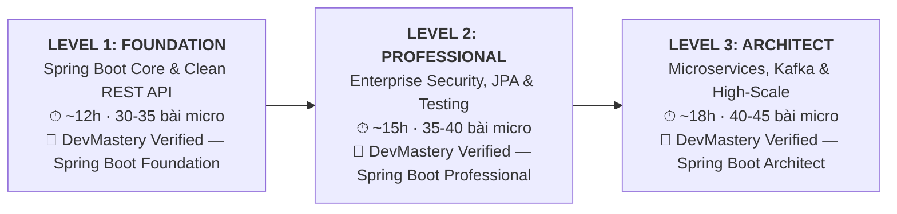
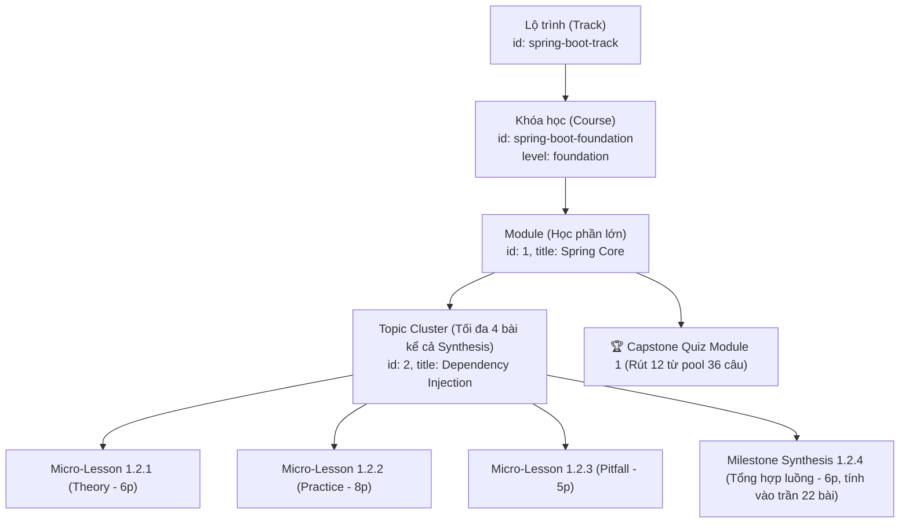

# BỘ QUY CHUẨN KỸ THUẬT THIẾT KẾ KHÓA HỌC (CES-2026 v2.4)
## DevMastery Course & Curriculum Engineering Standard — Rigorous Edition

> **Tài liệu đặc tả kỹ thuật bắt buộc dành cho Giảng viên, Kỹ sư Nội dung và Hệ thống AI Agent khi biên soạn hoặc thẩm định bất kỳ khóa học nào trên DevMastery Academy.**  
> *Được chuẩn hóa dựa trên triết lý Micro-Learning thực dụng, tích hợp biên bản đồng thuận 5-Expert Council (Product, Systems Architecture, Cognitive Science, Data Engineering, DevOps) và giải quyết triệt để 14 mâu thuẫn vận hành thực tế.*

---

## 1. Triết Lý Thiết Kế: Thực Dụng & Khép Kín (Pragmatic Engineering)

1. **Text-First & Interactive (Kiểu Educative):** Kỹ sư đọc và đối chiếu code nhanh gấp 2–3 lần xem video 40 giờ. Không dùng video thụ động; 100% nội dung là tài liệu kỹ thuật có thể tra cứu nhanh (`Ctrl + K`), copyable snippets và sơ đồ rõ ràng.
2. **Nhịp độ hoàn thành Micro-Pacing (Kiểu Udemy):** Phân rã bài học theo **Single Responsibility Principle (SRP)**. Mỗi bài giải quyết trọn vẹn đúng 1 vấn đề trong **5 – 10 phút**.
3. **Ngữ cảnh nghiệp vụ nhất quán (Consistent Domain Continuity):**
   * **Mỗi Track áp dụng một domain giả định cố định xuyên suốt:** Ví dụ với Java/Spring Boot Track, toàn bộ các bài học xoay quanh một hệ thống E-Commerce / Order Processing thu nhỏ.
   * **Cấm ví dụ đồ chơi (`foo/bar`, `Cat/Dog`):** 100% bài học phải dùng Entity có nghĩa (`Order`, `Payment`, `Product`, `Customer`).
   * **Không cấm nghiệp vụ nhỏ ở Level 1:** Ở Level 1 (Foundation), nghiệp vụ là tạo sản phẩm, giỏ hàng, tính tổng tiền đơn giản. **Tuyệt đối không ép nghiệp vụ ngân hàng phức tạp hay giao dịch phân tán vào Level 1** làm quá tải nhận thức học viên. Nghiệp vụ tài chính và concurrency chỉ đưa vào từ Level 2 (Professional) và Level 3 (Architect).
4. **Cơ chế Hai Làn Học Tập & Quy Tắc Phân Quyền (Dual-Track Governance):**
   * **Làn Khảo sát (Audit Track):** Học viên tự do truy cập bất kỳ bài nào, không bị khóa cổng 80%, phù hợp kỹ sư cần tra cứu nhanh giải pháp gỡ lỗi tức thì tại doanh nghiệp.
   * **Làn Chứng chỉ (Certified Track):** Bắt buộc vượt qua cổng 80% Quiz từng Module và nộp Đồ án Capstone pass kiểm thử tự động mới được cấp Chứng nhận xác thực (Verified Certificate).
   * **Quy tắc phân xử Challenge Solution & Hidden Test (Consensus Rule):**
     * **Lời giải mẫu Thử thách (Reference Solution):** Mở cho học viên Audit Track tham khảo sau khi thử sức (giấu trong thẻ `<details>` hoặc modal xác nhận). Tuy nhiên, nếu tài khoản đã bấm xem lời giải ở Audit Track, bài giải đó sẽ bị gắn cờ `inspected: true` và **vĩnh viễn không được tính vào tiến độ thi lấy bằng của Certified Track** (muốn lấy bằng phải giải bài variant khác hoặc thi Test-Out).
     * **Bộ kiểm thử ẩn (Hidden Test Harness):** **KHÓA TUYỆT ĐỐI 100% TRÊN CẢ HAI TRACK**. Mã nguồn bộ test ẩn chỉ nằm trên GitHub Actions runner bí mật của hệ thống. Cả hai làn chỉ nhận được Test Scorecard thông báo tên test case và nguyên nhân assertion fail, bảo vệ 100% tính toàn vẹn của kỳ thi.

---

## 2. Định Mức Quy Mô Chuẩn (Scale Caps & Boundary Limits)

Để triệt tiêu tình trạng "sinh nội dung cho đủ số" làm loãng chất lượng, spec quy định rõ trần định mức cứng (Hard Ceiling Caps):

| Thông số | Bản MVP (Minimum Viable Course) | Khóa Standard hoàn chỉnh | Trần tối đa (Hard Ceiling) |
|---|:---:|:---:|:---:|
| **Số lượng Module** | **4 Module** | **5 – 6 Module** | **8 Module** |
| **Số bài học / Module** | **12 – 16 bài** | **15 – 20 bài** | **22 bài** (Đã tính Synthesis) |
| **Số bài học / Topic** | **3 bài** | **3 – 4 bài** | **Tối đa 4 bài** (Kể cả Synthesis) |
| **Tổng số bài học toàn khóa** | **60 – 80 bài** | **90 – 120 bài** | **Tối đa 150 bài** |
| **Số câu Quiz rút ra / Module** | **10 – 12 câu** | **12 câu** | **12 câu** (Rút từ pool 36+) |
| **Ngân hàng đề Quiz / Module** | **Tối thiểu 36 câu** | **36 – 48 câu** | **60 câu** |
| **Thời lượng đọc & lab / bài** | **5 – 8 phút** | **6 – 10 phút** | **Tối đa 15 phút** |
| **Đồ án Capstone** | 1 đồ án Mini-Service | 1 đồ án End-to-End | 1 hệ thống hoàn chỉnh |

> [!IMPORTANT]
> **Quy tắc trần cứng (Ceiling Rule):**
> 1. Tuyệt đối không sinh khóa học vượt quá 150 bài vi mô hoặc module quá 22 bài.
> 2. **Bài Milestone Synthesis bắt buộc tính vào trần 22 bài này** (không được coi là bài phụ nằm ngoài định mức).
> 3. **Mỗi Topic tối đa 4 bài kể cả bài Synthesis** (ví dụ: 1 theory, 1 practice, 1 pitfall, 1 synthesis).

### 2.1. Quy Chuẩn Phân Tầng Cấp Độ (Multi-Level Course Segmentation — 3-Stage Career Track)

Tuyệt đối **cấm mô hình "Khóa học Monolith 80 giờ đi từ Zero đến Chuyên gia"**. Thực tế đào tạo toàn cầu chứng minh mô hình này có tỷ lệ bỏ học (drop-out) > 90% vì gây ra hiện tượng *"Kẻ đói thì nghẹn, người no thì ngán"* (Junior ngợp kiến thức gãy giữa chừng, Senior chán nản vì phải xem lại bài cài đặt căn bản).

Mọi ngăn xếp công nghệ lớn (như Java/Spring Boot, React/Next.js, Cloud DevOps) bắt buộc phải được quy hoạch thành **Lộ trình 3 Chặng (3-Stage Milestone Track)** với các khóa học độc lập có chứng chỉ riêng từng chặng:



#### Quy chuẩn Tách biệt Thực thể (Object Separation Principle):
* **Lộ trình (`Track`)** và **Khóa học (`Course`)** là **HAI OBJECT HOÀN TOÀN TÁCH BIỆT**:
  * `Track` đóng vai trò là container gom nhóm danh sách các Khóa học theo thứ tự tiến trình (`stages: []`).
  * `Course` là một thực thể độc lập có bài học, module, capstone riêng. Trường `level` của `Course` bắt buộc thuộc enum cụ thể: `"foundation" | "professional" | "architect"`.
  * **CẤM TUYỆT ĐỐI** gán `level: "Zero to Production"` trong schema Khóa. Một khóa học không thể bao thầu toàn bộ phổ kiến thức từ con số 0 đến cấp độ sản xuất cao cấp.
* **Danh xưng chứng nhận chuẩn hóa:**
  * Bắt buộc có định dạng: `DevMastery Verified — <course title>`.
  * **CẤM DÙNG TỪ "BẰNG" (Degree/Diploma)** vì nền tảng giáo dục công nghệ cấp chứng nhận hoàn thành đã được xác thực năng lực (Skill Verification), không cấp văn bằng học thuật quốc gia.
  * **CẤM GÁN CHỨC DANH NGHỀ NGHIỆP** (như "Junior Developer", "Enterprise Engineer", "Solutions Architect") vì chức danh nghề nghiệp thuộc thẩm quyền bổ nhiệm và đánh giá nội bộ của doanh nghiệp tuyển dụng.

#### Phân tách thực tế đối với Lộ trình Spring Boot:
* **Khóa 1 (Level: `foundation`): `spring-boot-foundation`**
  - Gồm Module 0 (Java 21/Maven) + Module 1 (Spring Core/IoC/DI) + Module 2 (REST API, RFC 7807).
  - Mục tiêu: Từ Zero viết được REST API chuẩn mực doanh nghiệp, hiểu rõ Bean lifecycle.
  - Chứng nhận: `DevMastery Verified — Spring Boot Foundation`.
* **Khóa 2 (Level: `professional`): `spring-boot-professional`**
  - Gồm Module 3 (JPA/Hibernate N+1, Locking) + Module 4 (JUnit 5, Testcontainers) + Module 5 (Spring Security 6, JWT, Keycloak).
  - Mục tiêu: Tối ưu hóa Database, bảo mật ngân hàng, test tự động đạt chuẩn CI/CD.
  - Chứng nhận: `DevMastery Verified — Spring Boot Professional`.
* **Khóa 3 (Level: `architect`): `spring-boot-architect`**
  - Gồm Module 6 (Kafka, Transactional Outbox, Saga, Redis) + Module 7 (Kubernetes, Observability, Capstone Project).
  - Mục tiêu: Thiết kế hệ thống phân tán chịu tải cao, giao dịch phân tán không mất dữ liệu, tự động hóa deploy cloud.
  - Chứng nhận: `DevMastery Verified — Spring Boot Architect`.

---

## 3. Cấu Trúc Thứ Bậc Dữ Liệu Đồng Nhất (Unified Hierarchy)

Để mã bài học (`Bài 1.2.3`), URL deep-link và Sidebar luôn khớp nhau 100%, cấu trúc phân cấp dữ liệu trong code bắt buộc tuân thủ **5 cấp độ từ Lộ trình xuống Bài học**:



### Quy tắc sinh Lesson ID & Title:
* **Mã ID bài học:** `[moduleId]-[topicIndex]-[subIndex]` (Ví dụ: `1-2-1`, `1-2-2`, `1-2-3`, `1-2-4`).
* **Tiêu đề bài học:**
  $$\text{Bài } [Module].[Topic].[Sub]: \text{ [Tên Kỹ Thuật Đơn Nhất]}$$
  *Ví dụ:* `Bài 1.2.1: Cơ chế ngầm: Inversion of Control & ApplicationContext Pipeline`
* **Deep-link Router:** `/courses/{courseId}/lessons/{moduleId}-{topicIndex}-{subIndex}`

---

## 4. Đặc Tả Dữ Liệu (Data Schema Standards)

> [!IMPORTANT]
> **Quy tắc Dữ liệu Tĩnh (Static Data Rule):** Mọi mẫu schema và dữ liệu ví dụ trong spec bắt buộc là **object tĩnh, hợp lệ 100%, copy-paste dùng được ngay**. Tuyệt đối không nhét biểu thức logic, điều kiện ternary `(a ? b : c)` hay hàm tính toán vào data structure.

### 4.1. Track Schema (`track_[tech].json` / `track.js`)
Lộ trình là object gom nhóm các khóa học độc lập theo từng chặng milestone:

```javascript
{
  id: "spring-boot-track",
  title: "Lộ Trình Kỹ Sư Spring Boot & Kiến Trúc Phân Tán",
  slug: "spring-boot-career-track",
  category: "backend",
  domainContext: "E-Commerce Order & Payment Management System",
  desc: "Lộ trình 3 chặng từ nền tảng Spring Boot đến kiến trúc Microservices và bảo mật doanh nghiệp.",
  stages: [
    {
      level: "foundation",
      courseId: "spring-boot-foundation",
      title: "Spring Boot Foundation — Core & Clean REST API",
      certificate: "DevMastery Verified — Spring Boot Foundation"
    },
    {
      level: "professional",
      courseId: "spring-boot-professional",
      title: "Spring Boot Professional — JPA, Security & Testing",
      certificate: "DevMastery Verified — Spring Boot Professional"
    },
    {
      level: "architect",
      courseId: "spring-boot-architect",
      title: "Spring Boot Architect — Kafka, Outbox & High-Scale",
      certificate: "DevMastery Verified — Spring Boot Architect"
    }
  ]
}
```

### 4.2. Course Schema (`course_[tech].json` / `course.js`)
Mỗi khóa học là một thực thể độc lập thuộc một level duy nhất (`foundation`, `professional`, hoặc `architect`). Cấm tuyệt đối `level: "Zero to Production"`.

```javascript
{
  id: "spring-boot-foundation",
  trackId: "spring-boot-track",
  title: "Spring Boot 3 Core & RESTful API Architecture",
  shortTitle: "Spring Boot Foundation",
  icon: "🌱",
  badge: "Foundation Level",
  category: "backend",
  level: "foundation",                    // "foundation" | "professional" | "architect" (CẤM: "Zero to Production")
  hours: "~12h",                          // Tổng giờ đọc và hoàn thành lab thực tế
  
  // Định hướng đối tượng & Cam kết đầu ra
  desc: "Nắm vững nguyên lý cốt lõi Spring Framework, IoC Container, Bean Lifecycle và xây dựng RESTful API chuẩn RFC 7807.",
  outcomes: [
    "Tự thiết kế và triển khai RESTful API chuẩn RFC 7807 ProblemDetails",
    "Làm chủ vòng đời Bean, ApplicationContext và khắc phục dứt điểm cạm bẫy Circular Dependency",
    "Áp dụng Clean Architecture phân tầng rõ ràng giữa Web, Service và Repository Layer",
    "Viết Unit Test cho Service Layer sử dụng Mockito và AssertJ đạt độ bao phủ chuẩn"
  ],
  prerequisites: [
    "Đã nắm vững cú pháp Java Core cơ bản (OOP, Interface, Collections, Java Record)",
    "Biết sử dụng Git cơ bản và hiểu nguyên lý hoạt động của HTTP/REST"
  ],
  notFor: [
    "Người chưa từng học bất kỳ ngôn ngữ lập trình nào (cần học Java Core trước)",
    "Kỹ sư Senior đã thành thạo Spring Core cần học kiến trúc phân tán (nên đăng ký khóa Architect)"
  ],

  // Quản trị vòng đời công nghệ (Tech Lifecycle)
  stackVersion: {
    java: "21 LTS",
    springBoot: "3.3+",
    hibernate: "6.5+",
    lastReviewedDate: "2026-10-04",
    maintainer: "DevMastery Architecture Council"
  },

  // Chỉ số thống kê (TÁCH BIỆT: Chỉ render khi có dữ liệu telemetry thật từ database)
  stats: null,

  themeGradient: "linear-gradient(135deg, #064e3b 0%, #047857 50%, #10b981 100%)",
  isAvailable: true,
  modules: [ ... ]
}
```

### 4.3. Module Schema (`module_[id].json` / `module.js`)
Module bắt buộc có `outcomes`, `retrievalWarmup` dạng object tĩnh (mảng tĩnh gồm 3 câu hỏi cho Module 1+; hoặc `null` tĩnh cho Module 0), và mảng `topics`:

```javascript
{
  id: 1,
  courseId: "spring-boot-foundation",
  title: "Spring Core & Container Internals",
  subtitle: "IoC Container, Dynamic Proxy, Bean Lifecycle & Auto-configuration",
  icon: "🌱",
  color: "#22c55e",
  desc: "Đào sâu bản chất hoạt động của Spring Framework bên dưới lớp vỏ cú pháp.",
  
  outcomes: [
    "Hiểu cặn kẽ cơ chế Reflection và ApplicationContext khởi tạo Bean",
    "Phân biệt CGLIB vs JDK Dynamic Proxy và tránh lỗi Self-Invocation @Transactional",
    "Tự viết được Spring Boot Starter tái sử dụng trong nội bộ doanh nghiệp"
  ],

  // Kích hoạt trí nhớ (Spaced Retrieval): 3 câu trắc nghiệm tĩnh kiểm tra module trước
  // GHI CHÚ: Đối với Module 0, trường này bắt buộc là null tĩnh: retrievalWarmup: null
  retrievalWarmup: [
    {
      q: "Điểm khác biệt cốt lõi giữa Java Record và Class thông thường là gì?",
      options: [
        "Record có thể kế thừa class khác bằng từ khóa extends",
        "Record mặc định bất biến (immutable), final và tự sinh canonical constructor",
        "Record không thể triển khai (implements) interface",
        "Record chỉ tương thích với JVM 8 trở xuống"
      ],
      answer: 1,
      explain: "Java Record tự động sinh constructor chuẩn, getter (không có tiền tố get), equals, hashCode và toString, đồng thời là final class không thể kế thừa."
    },
    {
      q: "Annotation nào kích hoạt quá trình quét component tự động trong Spring Boot?",
      options: [
        "@EnableAutoConfiguration",
        "@ComponentScan",
        "@SpringBootConfiguration",
        "@Configuration"
      ],
      answer: 1,
      explain: "@ComponentScan chịu trách nhiệm quét các package để tìm kiếm các bean có gắn annotation @Component, @Service, @Repository, @Controller."
    },
    {
      q: "Trong Java 21, tính năng nào giúp thực thi hàng triệu luồng I/O nhẹ mà không tốn nhiều RAM hệ thống?",
      options: [
        "CompletableFuture",
        "Virtual Threads (Project Loom)",
        "Parallel Streams",
        "ForkJoinPool"
      ],
      answer: 1,
      explain: "Virtual Threads trong Java 21 do JVM quản lý ở user space, cho phép mở hàng triệu luồng đồng thời mà không bị giới hạn bởi 1:1 OS Thread."
    }
  ],

  topics: [
    {
      id: 1,
      title: "Inversion of Control & Dependency Injection",
      lessons: [ ... ] // Tối đa 4 bài (kể cả bài Synthesis)
    },
    {
      id: 2,
      title: "AOP & Dynamic Proxies",
      lessons: [ ... ] // Tối đa 4 bài (kể cả bài Synthesis)
    }
  ],

  // Cấu hình sát hạch module (Rút 12 từ pool 36+)
  quiz: {
    id: "1-quiz",
    title: "Sát Hạch Năng Lực Module 1: Spring Core & Container",
    poolSize: 36,         // Tối thiểu 36 câu trong ngân hàng đề
    pullCount: 12,        // Rút ngẫu nhiên đúng 12 câu cho mỗi lượt thi
    passThresholdPct: 80, // Tối thiểu 80% (đúng 10/12 câu trên Certified Track)
    allowRetake: true
  }
}
```

---

## 5. Ma Trận Khung Nội Dung Theo Lesson Type (Flexible Blueprint Matrix)

Tuyệt đối **không ép một khuôn 5 phần cứng nhắc** cho mọi bài học. Mỗi `type` có quy định khối bắt buộc và khối cấm riêng:

| Thành phần nội dung | `theory` (📖 Lý thuyết) | `practice` (💻 Thực hành) | `pitfall` (⚠️ Cạm bẫy) | `challenge` (🏆 Thử thách) | `synthesis` (🗺️ Tổng hợp) |
|---|:---:|:---:|:---:|:---:|:---:|
| **Bối cảnh thực tế (Real-world Hook)** | **BẮT BUỘC** | Khuyến khích | **BẮT BUỘC** | **BẮT BUỘC** | Tùy chọn |
| **Sơ đồ Mermaid / Mental Model** | **BẮT BUỘC** | Tùy chọn | Tùy chọn | Không cần | **BẮT BUỘC (Sơ đồ lớn)** |
| **Mã nguồn chạy được (Runnable Code)** | Không ép (chỉ đoạn ngắn) | **BẮT BUỘC (100% test pass)** | Chỉ code lỗi & code sửa | Không (Chỉ trong Lời giải) | Không |
| **Lệnh kiểm thử (cURL / Test Command)** | Không | **BẮT BUỘC** | **BẮT BUỘC** | Không | Không |
| **Triệu chứng lỗi & Post-Mortem** | Không cần | Không cần | **BẮT BUỘC** | Không cần | Không cần |
| **Gợi ý giấu kín (Collapsible Hint)** | Không | Không | Không | **BẮT BUỘC** | Không |
| **Reference Solution & Trade-offs** | Không | Không | Không | **BẮT BUỘC (Audit có cờ)** | Không |
| **Khối hộp ghi nhớ (`:::tip`, `:::warn`)** | `:::takeaways` | `:::tip` | `:::warn` / `:::danger` | `:::takeaways` | `:::takeaways` |

### 5.1. Cấu trúc bài `theory` (Thời lượng: 5 – 7 phút)
1. **The Why (Hook):** Vấn đề kiến trúc trong thực tế theo domain của track.
2. **Mental Model & Mermaid Diagram:** 1 sơ đồ giải thích trực quan luồng hoạt động.
3. **Under the Hood Explanation:** Cơ chế bên dưới JVM/Network/Kernel (300 – 600 từ).
4. **`:::takeaways`:** 2–3 gạch đầu dòng cốt lõi.

### 5.2. Cấu trúc bài `practice` (Thời lượng: 8 – 12 phút)
1. **Bài toán kinh doanh cụ thể:** (Theo domain chung của track, ví dụ: Tính tổng tiền đơn hàng).
2. **Triển khai Mã nguồn chuẩn:** Code hoàn chỉnh từ Model -> Repository -> Service -> Controller.
3. **Lệnh thực thi & Kiểm chứng (Verification):** Kịch bản lệnh cURL hoặc Test Class cụ thể, in rõ Output mẫu mong đợi. **Mọi lệnh này phải chạy thành công trên CI PR Gate**.
4. **`:::tip`:** Mẹo Clean Code hoặc quy ước cấu trúc dự án.

### 5.3. Cấu trúc bài `pitfall` (Thời lượng: 5 – 8 phút)
1. **Triệu chứng (The Symptom):** Lỗi log gì văng ra ở production? Alert Prometheus cảnh báo cái gì?
2. **Căn nguyên kỹ thuật (Root Cause):** Tại sao code chạy ngon trên máy dev nhưng sập trên môi trường tải cao?
3. **Mã nguồn lỗi vs Mã nguồn khắc phục (Diff Code):** So sánh trực tiếp code SAI và code ĐÚNG.
4. **Bài học hậu kiểm (Post-Mortem):** Quy tắc viết Unit Test hoặc cấu hình Alert để lỗi không bao giờ tái diễn.

### 5.4. Cấu trúc bài `challenge` (Thời lượng: 10 – 15 phút) & Quy chuẩn Giàn giáo (Scaffolding)
* **Quy tắc Scaffolding:** Không bắt học viên viết từ đầu (Zero-scratch). Cung cấp sẵn một repo starter kit với 90% phần khung đã chạy, học viên chỉ cần điền đúng **1 hàm thuật toán lõi** hoặc **sửa đúng 1 file cấu hình lỗi** (Bug Bounty format).
* **Đặc tả yêu cầu & Ràng buộc:** Rõ ràng I/O, thời gian thực thi tối đa, memory footprint.
* **Gợi ý từng bước:** Giấu sau thẻ `<details>` để học viên tự tư duy trước.
* **Lời giải mẫu chuẩn (Reference Solution):** Lời giải đạt tiêu chuẩn Senior kèm phân tích đánh đổi (Trade-offs). Mở cho học viên Audit Track xem nhưng gắn cờ cấm nộp sang Certified Track.

### 5.5. Cấu trúc bài `synthesis` (Thời lượng: 5 – 8 phút) — Chống Phân Mảnh Kiến Thức
* **Vị trí:** Nằm ở cuối mỗi Topic Cluster (sau 2–3 bài vi mô).
* **Quy tắc định mức cứng:**
  * **Bài Synthesis tính trực tiếp vào trần cứng 22 bài/module** (mang mã ID micro-lesson chuẩn, ví dụ: `1-2-4`).
  * **Mỗi Topic tối đa 4 bài kể cả Synthesis:** (Ví dụ: `1.2.1 Theory`, `1.2.2 Practice`, `1.2.3 Pitfall`, `1.2.4 Synthesis`).
* **Bản đồ luồng toàn cảnh (Grand Schema Map):** 1 sơ đồ Mermaid lớn kết nối toàn bộ các thành phần đã học thành 1 chu trình nghiệp vụ khép kín.
* **Bảng tổng kết quyết định (Decision Matrix):** Khi nào dùng kỹ thuật A vs khi nào dùng kỹ thuật B.

---

## 6. Quy Chuẩn Phần Cứng & Profile Môi Trường Theo Từng Level (Hardware Tolerance & Execution Profiles)

Để đảm bảo vừa phản ánh đúng bản chất kỹ thuật sản xuất, vừa hỗ trợ học viên máy tính cấu hình khiêm tốn (8GB – 16GB RAM):

### 6.1. Phân Tầng Profile Theo Cấp Độ Khóa Học

1. **Level 1 (Foundation):**
   * Cho phép sử dụng In-Memory components: **H2 Database, Embedded Redis, MockWebServer**.
   * Profile mặc định: `local-lite`. Mức tiêu thụ RAM tối đa: `< 1.5 GB RAM`.
   * Mục tiêu: Học viên tập trung học cú pháp Spring Core, Bean IoC và HTTP/REST API mà không cần cài đặt Docker phức tạp.

2. **Level 2 (Professional) & Level 3 (Architect):**
   * **CẤM DÙNG H2 DATABASE CHO CÁC BÀI DATA VÀ CONCURRENCY:**
     * *Lý do kỹ thuật:* H2 không mô phỏng được MVCC engine thực tế, không có PostgreSQL/MySQL row-level locking, gap locking, deadlock detection hay cạm bẫy connection leak HikariCP. Nếu chỉ pass trên H2 thì các bài phân tích N+1 và Locking trở thành lý thuyết suông.
   * **Bắt buộc có Profile thật (`enterprise-docker`) trên Certified Track:**
     * Các bài thực hành Data và Concurrency từ Level 2 trở đi **bắt buộc chạy trên Database thật (PostgreSQL/MySQL + Redis)** mới được tính là hoàn thành trên Certified Track.
     * Nếu học viên chọn chạy `local-lite` H2, bài làm chỉ được ghi nhận tiến độ trên Làn Khảo Sát (Audit Track).
   * **Đường Thoái Lui Cho Máy Yếu (Low-spec Fallback Pathway):**
     * Cung cấp file `docker-compose.lite.yml` với giới hạn tài nguyên khắt khe: PostgreSQL (`mem_limit: 512m`, `cpus: 0.5`), Redis (`mem_limit: 128m`).
     * Cung cấp sẵn cấu hình kết nối tới Free Cloud Database (như Supabase, Neon Postgres, Aiven Redis) qua file `application-cloud-dev.yml` chỉ bằng 1 biến môi trường URL, đảm bảo học viên máy yếu 8GB RAM vẫn chạy kiểm thử trên Database thật mà không bị treo máy.

---

## 7. Quy Chuẩn Đề Thi Sát Hạch & Cơ Chế Đánh Giá (Quiz & Placement Standard)

### 7.1. Định Mức Ngân Hàng Đề & Cơ Chế Rút Đề (Bank & Pull Mechanism)
* **Quy mô ngân hàng đề:** **Tối thiểu 36 câu hỏi tình huống** cho mỗi Module (không dùng ngân hàng nhỏ 12–16 câu cố định để chống việc học vẹt nhớ đề khi thi lại).
* **Số câu rút ngẫu nhiên:** Hệ thống **rút ngẫu nhiên đúng 12 câu hỏi** cho mỗi lượt thi sát hạch.
* **100% câu hỏi tình huống (Scenario-Based):** Phân tích sự cố hạ tầng, lỗi race condition, deadlock, memory leak. Cấm câu hỏi định nghĩa từ điển.
* **4 Đáp án phân hóa (Plausible Distractors):** Đáp án sai phải phản ánh đúng những sai lầm thường gặp của lập trình viên Junior/Mid.
* **Bắt buộc phân tích đáp án (Deep Explanation):** Chỉ rõ tại sao đáp án đúng là giải pháp chuẩn, và tại sao từng đáp án sai sẽ gây ra lỗi gì ở production.
* **Telemetry & Quản Trị Chất Lượng Câu Hỏi:**
  * Hệ thống tự động ghi log tỷ lệ trả lời đúng của từng câu hỏi trong ngân hàng đề.
  * **Quy tắc đào thải & viết lại:**
    * Nếu một câu hỏi có tỷ lệ trả lời đúng **> 90%** (quá hiển nhiên / lộ đề) hoặc **< 30%** (đánh đố / câu chữ nhập nhằng / sai logic kỹ thuật): Kỹ sư nội dung **bắt buộc phải viết lại hoặc loại bỏ khỏi ngân hàng đề trong vòng 7 ngày**.

### 7.2. Cổng Năng Lực & Retake Policy
* **Ngưỡng đạt (Pass Threshold):** Trả lời đúng **tối thiểu 80%** (đúng 10/12 câu được rút) trên *Certified Track*.
* **Cơ chế thi lại (Adaptive Retake):** Nếu chưa đạt 80%, lượt thi tiếp theo sẽ rút 12 câu khác từ ngân hàng 36+ câu. Hệ thống chỉ rõ học viên cần đọc lại bài vi mô cụ thể nào trước khi thi lại.

### 7.3. Quy Chuẩn Bài Test Đánh Giá Đầu Vào & Vượt Cấp (Skill Placement & Module Test-Out Engine)

#### 1. Bài Test Đánh Giá Đầu Vào (Placement Test — 15 Câu Tình Huống / 20 Phút)
* **VAI TRÒ DUY NHẤT: GỢI Ý & TƯ VẤN LỘ TRÌNH (Advisory Placement Only)**.
* **CẤM TUYỆT ĐỐI DÙNG BÀI 15 CÂU ĐỂ MIỄN CHỨNG CHỈ CẤP DƯỚI:** Kết quả bài test chỉ giúp học viên biết mình nên bắt đầu học từ khóa nào để không lãng phí thời gian, hoàn toàn KHÔNG cấp chứng nhận xác thực của bất kỳ Level nào.
* **Quy chuẩn Định dạng & Giới hạn giờ (No Anti-Cheat Claim):**
  * Giới hạn thời gian **20 phút / 15 câu** là định mức thời gian bài thi tiêu chuẩn (time budget).
  * **Tuyệt đối không đưa ra các tuyên bố chống gian lận phi thực tế** (như "triệt tiêu ChatGPT", "chống gian lận tuyệt đối").
  * **Bỏ quy định cấm copy/paste trên giao diện** vì không mang lại giá trị bảo mật kỹ thuật và gây ức chế trải nghiệm người dùng.

| Điểm số đạt được | Tỷ lệ chính xác | Đánh giá năng lực | Luồng điều hướng đề xuất (Recommended Path) |
|---|:---:|---|---|
| **0 – 7 / 15** | `< 50%` | **Chưa vững nền tảng (Foundation Gap)** | Khuyến nghị bắt đầu từ **Khóa Foundation (Level 1)** để củng cố nền tảng cốt lõi. |
| **8 – 11 / 15** | `50% – 79%` | **Đã có kinh nghiệm cơ bản (Mid-ready)** | Khuyến nghị học thẳng **Khóa Professional (Level 2)** để đào sâu Database & Security. |
| **12 – 15 / 15** | `≥ 80%` | **Kỹ sư dày dạn (Senior / Lead)** | Khuyến nghị học thẳng **Khóa Architect (Level 3)** để làm chủ Hệ thống phân tán. |

#### 2. Quy Tắc Thi Vượt Cấp Chuẩn Từng Module (Module Test-Out Engine)
* Nếu học viên muốn bỏ qua các module để lấy chứng nhận hoặc mở khóa có điều kiện ở Làn Chứng Chỉ (Certified Track), học viên **BẮT BUỘC PHẢI THI TEST-OUT ĐÚNG TỪNG MODULE** (vượt qua bài Quiz Sát hạch 12 câu rút từ pool 36 câu của chính module đó với kết quả `≥ 80%`).
* Tuyệt đối không chấp nhận cơ chế "làm 1 bài 15 câu miễn toàn bộ cấp độ". Mỗi module có chuẩn đầu ra riêng biệt và bắt buộc phải được bảo chứng bằng bài sát hạch của chính module đó.

---

## 8. Quy Chuẩn Đồ Án Tốt Nghiệp Cuối Khóa (Capstone Project & Phân Tầng Rubric)

Module cuối cùng của khóa học **bắt buộc là Dự Án Thực Chiến (Capstone Project)**, không dùng trắc nghiệm làm thước đo tốt nghiệp.

### 8.1. Cổng Đỗ Tốt Nghiệp Bắt Buộc (Mandatory Pass Gate — Máy Chấm Tự Động)
Để đảm bảo tính khách quan tuyệt đối, loại bỏ cảm tính và kiểm soát chi phí hạ tầng (ngân sách CI `< 4 phút` trên standard runner):
1. Học viên nộp đường link GitHub repository cá nhân.
2. **GitHub Actions Test Runner của DevMastery** tự động clone và kích hoạt:
   * **`mvn test` (Hidden Test Suite):** Chạy 100% bộ test ẩn xác thực logic nghiệp vụ và edge cases. Pass 100% là điều kiện tiên quyết.
   * **`ArchUnit Scanner`:** Kiểm tra tính toàn vẹn kiến trúc **đúng tầm của từng Level**.
3. Hệ thống trả về Scorecard tự động sau 3–4 phút. Vượt qua 2 cổng này là **ĐỦ ĐIỀU KIỆN TỐT NGHIỆP**.

### 8.2. Hạng Mục Phân Hóa / Điểm Cộng Xuất Sắc (Bonus & Distinction — Không Phải Cổng Chặn)
* **k6 Load Testing (500 TPS / P95 Latency):** Chạy theo hàng đợi riêng (queue), đo đạc hiệu năng và rò rỉ bộ nhớ. Là **Điểm cộng xếp loại Xuất sắc (Distinction Badge)** trên chứng nhận, **KHÔNG DÙNG LÀM CỔNG CHẶN TỐT NGHIỆP** (tránh đánh trượt oan do biến động CPU/mạng của runner miễn phí).
* **Phản biện Tài Liệu ADR với AI:** AI Kỹ sư Trưởng đóng vai trò Mentor phân tích file `ADR.md` (Architecture Decision Record) và đưa ra 2 câu hỏi phản biện chuyên sâu. Phần phản biện này được ghi chú nhận xét chuyên môn trên Scorecard, **AI KHÔNG ĐƯỢC QUYỀN ĐÁNH ĐỖ/TRƯỢT HỌC VIÊN**. Quyền đỗ/trượt hoàn toàn thuộc về máy chấm khách quan.

### 8.3. Bảng Rubric Đánh Giá Phân Tầng Theo Level (3 Distinct Level Rubrics)

Tuyệt đối **không áp dụng chung một rubric cấp cao cho tất cả các level**:

#### Bảng 1: Rubric Đánh Giá Khóa Foundation (Level 1)
| Hạng mục | Cổng Đỗ Bắt Buộc (Pass Gate) | Điểm Cộng Phân Hóa (Distinction Bonus) |
|---|---|---|
| **API Contract & Validation** | REST API chuẩn RFC 7807 ProblemDetails, DTO validation chặt chẽ với `@Valid`. | Có đầy đủ Custom Error Codes chi tiết theo domain. |
| **Kiến Trúc Phân Tầng** | Phân tầng rõ ràng: Controller -> Service -> Repository. ArchUnit: Controller không gọi trực tiếp Repository, không để lộ Entity ra ngoài API Layer. | Áp dụng MapStruct mapper, tách biệt hoàn toàn giữa Request DTO và Response DTO. |
| **Unit Testing** | Service Unit Test sử dụng Mockito phủ 100% các luồng chính (happy path). | Độ bao phủ kiểm thử (Line Coverage) đạt > 80% với đầy đủ nhánh lỗi. |
| *Lưu ý ràng buộc:* | **TUYỆT ĐỐI KHÔNG CHẤM Hexagonal Architecture, Pact Contract Test hay K8s Deployment ở Level 1.** |

#### Bảng 2: Rubric Đánh Giá Khóa Professional (Level 2)
| Hạng mục | Cổng Đỗ Bắt Buộc (Pass Gate) | Điểm Cộng Phân Hóa (Distinction Bonus) |
|---|---|---|
| **Database & Concurrency** | Triệt tiêu 100% lỗi Hibernate N+1 (JOIN FETCH/EntityGraph). Xử lý Optimistic/Pessimistic Locking chống bán âm đơn hàng. | Benchmark so sánh hiệu năng giữa Batch Insert vs Single Insert với HikariCP. |
| **Security & Authentication** | Cấu hình Spring Security 6 SecurityFilterChain chuẩn, xác thực JWT Stateless, phân quyền theo Role/Authority. | Tích hợp OAuth2 Resource Server với Keycloak thật qua Docker. |
| **Integration Testing** | Viết Integration Test với Testcontainers chạy trên PostgreSQL thật. | Viết Slice Test `@DataJpaTest` và `@WebMvcTest` tối ưu thời gian chạy dưới 30s. |

#### Bảng 3: Rubric Đánh Giá Khóa Architect (Level 3)
| Hạng mục | Cổng Đỗ Bắt Buộc (Pass Gate) | Điểm Cộng Phân Hóa (Distinction Bonus) |
|---|---|---|
| **Distributed Architecture** | Triển khai Transactional Outbox Pattern với Apache Kafka. Đảm bảo Idempotent Consumer chống trùng lặp sự kiện thanh toán. | Triển khai Saga Pattern (Orchestration/Choreography) có bù trừ giao dịch (Compensating Transactions). |
| **Resilience & Fault Tolerance** | Cấu hình Circuit Breaker (Resilience4j) và Redis Distributed Cache chống Cache Stampede. | k6 Test tải 500 TPS với P95 < 200ms, zero packet drop khi kích hoạt Chaos container restart. |
| **Clean Architecture & Cloud** | ArchUnit kiểm tra Modular Monolith / Hexagonal: Ranh giới Domain thuần khiết, zero cycle dependencies giữa các context. Docker multi-stage layered jar. | Viết kịch bản K8s Graceful Shutdown, Zero-Downtime Deployment và tích hợp Prometheus/Grafana metrics. |

### 8.4. Danh Xưng Chứng Nhận Chuẩn Hóa
* Mẫu văn bản chứng nhận: **`DevMastery Verified — <Tên Khóa Học>`** (Ví dụ: `DevMastery Verified — Spring Boot Foundation`).
* Tuyệt đối không dùng từ "Bằng" hoặc chức danh nghề nghiệp ("Junior Developer", "Enterprise Engineer", "Solutions Architect").

### 8.5. Quy Chuẩn Bảo Mật & Quyền Riêng Tư Khi Clone Repo Học Viên (Student Code Privacy Policy)
1. **Điều khoản nộp bài minh bạch (Submission Terms):** Học viên cấp quyền read-only tạm thời cho Test Runner của DevMastery để phục vụ mục đích kiểm thử và sinh Scorecard.
2. **Chính sách tự động xóa sau 7 ngày (7-Day Artifact Retention):** Toàn bộ mã nguồn clone về runner và các test artifact sinh ra **bắt buộc phải được xóa sạch hoàn toàn khỏi hệ thống lưu trữ sau 7 ngày kể từ khi trả lời kết quả**.
3. **Cam kết bảo vệ bản quyền dữ liệu (No AI Training Commitment):** DevMastery **cam kết tuyệt đối không sử dụng mã nguồn bài nộp của học viên để huấn luyện (train/fine-tune) bất kỳ mô hình AI nào**.

---

## 9. Quản Trị Vòng Đời Tự Động & Cổng Chặn Merge (Automated CI & Merge Gates)

### 9.1. Weekly CI Pipeline (Quản Trị Phá Vỡ Mã Nguồn)
1. **Weekly CI Matrix:** Toàn bộ code mẫu của khóa học được quản lý trong repo chuẩn và được GitHub Actions tự động build test vào **0h00 Chủ nhật hàng tuần**.
2. **Cơ chế Cảnh báo (Automated Breaking Change Alert):**
   * Nếu có bản vá thư viện hoặc JDK mới làm gãy code, GitHub Actions tự động bắn cảnh báo về kênh Discord/Telegram của ban quản trị.
   * Kỹ sư nội dung có SLA **72 giờ** để cập nhật bài học và code mẫu.

### 9.2. Cổng Chặn Kiểm Thử Khi Sinh Nội Dung (Content Generation Merge Gate)
* **Quy tắc Thực thi Bắt buộc đối với bài `practice`:**
  * Mọi bài học có type `practice` do Giảng viên hoặc AI Agent biên soạn **tuyệt đối không được merge vào repo nếu các câu lệnh thực thi (cURL, Maven test, bash command) trong bài chạy thất bại**.
  * CI PR Gate tự động bóc tách các đoạn mã runnable và lệnh kiểm thử trong bài học để chạy trên runner. Nếu exit code != 0, PR bị gắn trạng thái `BLOCKED` ngay lập tức.

---

## 10. Định Nghĩa Hoàn Thành Nội Dung (Content Definition of Done — Content DoD)

Một bài học hoặc khóa học chỉ được coi là hoàn tất về mặt nội dung khi tích đủ các điều kiện sau:

- [ ] **Định mức khép kín:** Khóa MVP từ 60–80 bài, mỗi module từ 12–20 bài, trần cứng 22 bài/module (**đã bao gồm các bài Milestone Synthesis**). Mỗi Topic tối đa 4 bài kể cả Synthesis.
- [ ] **Tách biệt Object Khóa & Lộ trình:** Lộ trình (`Track`) gom nhóm các Khóa (`Course`). Trường `level` của Khóa bắt buộc thuộc enum chuẩn: `foundation | professional | architect`. Cấm `level: "Zero to Production"`.
- [ ] **Data Model chuẩn & Tĩnh:** 100% schema và dữ liệu mẫu là object tĩnh, không chứa biểu thức code hay cú pháp ternary; `retrievalWarmup` là mảng tĩnh hoặc `null` ở Module 0.
- [ ] **Domain Context nhất quán:** Sử dụng một domain giả định cố định cho cả track (ví dụ: E-Commerce); cấm `foo/bar`, nhưng không ép nghiệp vụ ngân hàng phức tạp ở Level 1.
- [ ] **Profile thực thi theo Level:** Foundation cho phép `local-lite` H2; Level 2+ bắt buộc database thật (PostgreSQL/Redis) mới tính Certified, kèm đường thoái lui tài nguyên thấp cho máy yếu.
- [ ] **Đồng bộ mã nguồn & Merge Gate:** 100% mã nguồn và lệnh trong bài `practice` phải pass kiểm thử trên CI Runner trước khi merge.
- [ ] **Có bài Milestone Synthesis:** Mỗi Topic Cluster có 1 bài tổng hợp luồng kiến trúc (tính vào trần 22 bài).
- [ ] **Ngân hàng đề Quiz chuẩn:** Tối thiểu 36 câu hỏi kịch bản/module, rút 12 câu ngẫu nhiên/lượt thi; có telemetry log đào thải câu >90% hoặc <30%.
- [ ] **Placement chỉ gợi ý, Test-Out theo Module:** Placement 15 câu là gợi ý điều hướng; muốn nhảy cóc/lấy bằng phải test-out đạt ≥ 80% đúng từng module. Bỏ claim chống gian viển vông và cấm paste UI.
- [ ] **Phân quyền Dual-Track minh bạch:** Mở Reference Solution có cờ đánh dấu cho Audit track; khóa 100% Hidden Test Suite đối với cả hai làn.
- [ ] **Capstone chuẩn máy chấm:** Cổng đỗ là Hidden Test + ArchUnit đúng tầm level chạy dưới 4 phút; k6 và AI ADR là điểm cộng phân hóa, không dùng đánh đỗ/trượt.
- [ ] **Danh xưng chứng nhận chuẩn:** Định dạng `DevMastery Verified — <Tên Khóa Học>`, cấm dùng chữ "bằng" và cấm gán chức danh nghề nghiệp.
- [ ] **Bảo mật mã nguồn học viên:** Cam kết xóa artifact sau 7 ngày, không dùng bài nộp để train AI.
- [ ] **Loại bỏ số liệu ảo:** Metadata không chứa rating/học viên giả định nếu chưa có telemetry thật.
- [ ] **Mobile Responsive:** Hiển thị mượt mà trên viewport di động (390×844), không lỗi layout.
- [ ] **Đồng bộ Phiên Bản Nội Dung:** Toàn bộ code mẫu, tài liệu và dữ liệu khóa học được commit vào nhánh `main` với version spec đồng nhất. *(Lưu ý: Việc deploy lên hạ tầng production/gh-pages là tác vụ platform/infra, không thuộc DoD nội dung bài học).*
