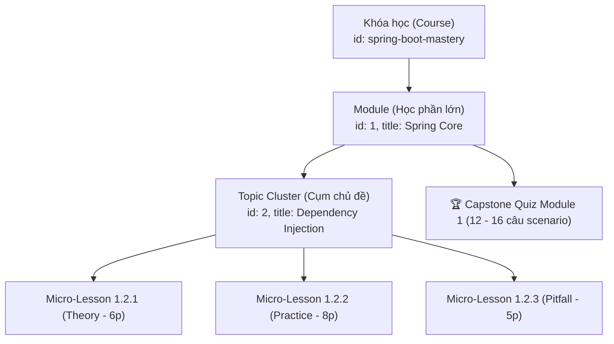

# BỘ QUY CHUẨN KỸ THUẬT THIẾT KẾ KHÓA HỌC (CES-2026 v2.0)
## DevMastery Course & Curriculum Engineering Standard — Production Edition

> **Tài liệu đặc tả kỹ thuật bắt buộc dành cho Giảng viên, Kỹ sư Nội dung và Hệ thống AI Agent khi biên soạn hoặc thẩm định bất kỳ khóa học nào trên DevMastery Academy.**  
> *Được chuẩn hóa dựa trên triết lý Micro-Learning thực dụng, kiểm định năng lực khép kín và loại bỏ hoàn toàn các chỉ số ảo/nội dung rác.*

---

## 1. Triết Lý Thiết Kế: Thực Dụng & Khép Kín (Pragmatic Engineering)

1. **Text-First & Interactive (Kiểu Educative):** Kỹ sư đọc và đối chiếu code nhanh gấp 2–3 lần xem video 40 giờ. Không dùng video thụ động; 100% nội dung là tài liệu kỹ thuật có thể tra cứu nhanh (`Ctrl + K`), copyable snippets và sơ đồ rõ ràng.
2. **Nhịp độ hoàn thành Micro-Pacing (Kiểu Udemy):** Phân rã bài học theo **Single Responsibility Principle (SRP)**. Mỗi bài giải quyết trọn vẹn đúng 1 vấn đề trong **5 – 10 phút**.
3. **Cạm bẫy & Sự cố Hậu kiểm (Kiểu ByteByteGo):** Không dạy ví dụ đồ chơi (Toy Code: `foo/bar`, `Cat/Dog`). 100% bài học xuất phát từ ngữ cảnh sản xuất: Ngân hàng, Cổng thanh toán, Sàn thương mại điện tử, Hệ thống phân tán chịu tải cao.
4. **Kiểm định Năng lực Thực tế (Competency Gating):** Tick xanh tạo dopamine, nhưng **vượt qua cửa ải (Gate) mới tạo ra kỹ sư giỏi**. Học viên phải pass 80% Quiz tình huống và nộp Capstone Project chạy pass CI/CD mới được cấp chứng chỉ.

---

## 2. Định Mức Quy Mô Chuẩn (Scale Caps & Boundary Limits)

Để tránh tình trạng "sinh nội dung cho đủ số" làm loãng chất lượng, spec quy định rõ trần định mức (Ceiling Caps):

| Thông số | Bản MVP (Minimum Viable Course) | Khóa Standard hoàn chỉnh | Trần tối đa (Hard Ceiling) |
|---|:---:|:---:|:---:|
| **Số lượng Module** | **4 Module** | **5 – 6 Module** | **8 Module** |
| **Số bài học / Module** | **12 – 16 bài** | **15 – 20 bài** | **22 bài** |
| **Tổng số bài học toàn khóa** | **60 – 80 bài** | **90 – 120 bài** | **Tối đa 150 bài** |
| **Số câu Quiz / Module** | **10 – 12 câu** | **12 – 16 câu** | **Tối đa 18 câu** |
| **Thời lượng đọc & lab / bài** | **5 – 8 phút** | **6 – 10 phút** | **Tối đa 15 phút** |
| **Capstone Project** | 1 đồ án Mini-Service | 1 đồ án End-to-End | 1 hệ thống hoàn chỉnh |

> [!IMPORTANT]
> **Quy tắc trần cứng (Ceiling Rule):** Tuyệt đối không sinh khóa học vượt quá 150 bài vi mô hoặc module quá 22 bài. Nếu một chủ đề quá rộng, bắt buộc phải tách thành một Khóa học độc lập (ví dụ: tách *Spring Security Chuyên Sâu* ra khỏi *Spring Boot Core*).

---

## 3. Cấu Trúc Thứ Bậc Dữ Liệu Đồng Nhất (Unified Hierarchy)

Để mã bài học (`Bài 1.2.3`), URL deep-link và Sidebar không bị lệch pha, cấu trúc phân cấp dữ liệu trong code bắt buộc phải có **4 cấp độ đồng nhất**:



### Quy tắc sinh Lesson ID & Title:
* **Mã ID:** `[moduleId]-[topicIndex]-[subIndex]` (Ví dụ: `1-2-1`, `1-2-2`, `1-2-3`).
* **Tiêu đề bài học:**
  $$\text{Bài } [Module].[Topic].[Sub]: \text{ [Tên Kỹ Thuật Đơn Nhất]}$$
  *Ví dụ:* `Bài 1.2.1: Cơ chế ngầm: Inversion of Control & ApplicationContext Pipeline`
* **Deep-link Router:** `/courses/{courseId}/lessons/{moduleId}-{topicIndex}-{subIndex}`

---

## 4. Đặc Tả Dữ Liệu (Data Schema Standards)

### 4.1. Course Schema (`course_[tech].js` / `app.js`)
Loại bỏ hoàn toàn các số liệu marketing hardcode (`rating`, `studentsCount`). Phải có `outcomes`, `prerequisites`, `notFor`, `stackVersion`.

```javascript
{
  id: "spring-boot-mastery",
  title: "Spring Boot Mastery — Từ Zero Đến Production",
  shortTitle: "Spring Boot Mastery",
  icon: "🍃",
  badge: "Backend & Microservices",
  category: "backend",                    // "backend" | "frontend" | "devops" | "cloud"
  level: "Zero to Production",            // "Foundation" | "Zero to Production" | "Advanced"
  hours: "~35h",                          // Tổng giờ đọc và hoàn thành lab thực tế
  
  // Định hướng đối tượng & Cam kết đầu ra
  desc: "Lộ trình đào tạo toàn diện Spring Boot 3 & Java 21, kiến trúc Microservices và bảo mật doanh nghiệp.",
  outcomes: [
    "Tự thiết kế và triển khai RESTful API chuẩn RFC 7807 với Spring Boot 3",
    "Làm chủ vòng đời Bean, AOP Proxy và khắc phục dứt điểm cạm bẫy Self-Invocation",
    "Tối ưu truy vấn JPA/Hibernate, triệt tiêu lỗi N+1 bằng EntityGraph và Projections",
    "Bảo vệ hệ thống với Spring Security 6, JWT và phân quyền OAuth2/Keycloak",
    "Đóng gói Docker Layered Jar và triển khai Kubernetes với Zero-Downtime"
  ],
  prerequisites: [
    "Đã nắm vững cú pháp Java Core cơ bản (OOP, Interface, Collections)",
    "Biết sử dụng Git cơ bản và hiểu nguyên lý hoạt động của HTTP/REST"
  ],
  notFor: [
    "Người chưa từng học bất kỳ ngôn ngữ lập trình nào (cần học Java Core trước)",
    "Người chỉ tìm kiếm video lý thuyết để ngồi xem thụ động"
  ],

  // Quản trị vòng đời công nghệ (Tech Lifecycle)
  stackVersion: {
    java: "21 LTS",
    springBoot: "3.3+",
    hibernate: "6.5+",
    lastReviewedDate: "2026-10-04",
    maintainer: "DevMastery Architecture Council"
  },

  // Chỉ số thống kê (TÁCH BIỆT: Chỉ render khi có dữ liệu thật từ database)
  stats: null, // Hoặc: { rating: 4.9, reviewsCount: 380, enrolledCount: 1250 }

  themeGradient: "linear-gradient(135deg, #064e3b 0%, #047857 50%, #10b981 100%)",
  isAvailable: true,
  modules: [ ... ]
}
```

### 4.2. Module Schema
Bắt buộc có `outcomes`, `retrievalWarmup` (3 câu hỏi kích hoạt trí nhớ từ module trước) và mảng `topics`:

```javascript
{
  id: 1,
  title: "Spring Core & Container Internals",
  subtitle: "IoC Container, Dynamic Proxy, Bean Lifecycle & Auto-configuration",
  icon: "🌱",
  color: "#22c55e",
  desc: "Đào sâu bản chất hoạt động của Spring Framework bên dưới lớp vỏ cú pháp.",
  
  outcomes: [
    "Hiểu cặn kẽ cơ chế Reflection và ApplicationContext khởi tạo Bean",
    "Phân biệt CGLIB vs JDK Dynamic Proxy và tránh lỗi Self-Invocation @Transactional",
    "Tự viết được Spring Boot Starter tái sử dụng trong nội bộ doanh nghiệp"
  ],

  // Kích hoạt trí nhớ (Spaced Retrieval): 3 câu trắc nghiệm nhanh kiểm tra module trước
  retrievalWarmup: (moduleId === 0) ? null : [
    {
      q: "Điểm khác biệt cốt lõi giữa Java Record và Class thông thường là gì?",
      options: ["Record có thể kế thừa class khác", "Record mặc định bất biến (immutable) và final", "Record không có equals/hashCode", "Record chỉ chạy trên JVM 8"],
      answer: 1
    }
    // ... thêm 2 câu
  ],

  topics: [
    {
      id: 1,
      title: "Inversion of Control & Dependency Injection",
      lessons: [ ... ] // 3 - 5 micro-lessons
    },
    {
      id: 2,
      title: "AOP & Dynamic Proxies",
      lessons: [ ... ] // 3 - 5 micro-lessons
    }
  ],

  // Bài thi sát hạch cuối module (12 - 16 câu)
  quiz: {
    id: "1-quiz",
    title: "Sát Hạch Năng Lực Module 1: Spring Core & Container",
    passThresholdPct: 80, // Tối thiểu 80% mới mở khóa module sau
    allowRetake: true,
    questions: [ ... ]
  }
}
```

---

## 5. Ma Trận Khung Nội Dung Theo Lesson Type (Flexible Blueprint Matrix)

Tuyệt đối **không ép một khuôn 5 phần cứng nhắc** cho mọi bài học. Mỗi `type` có quy định khối bắt buộc và khối cấm riêng:

| Thành phần nội dung | `theory` (📖 Lý thuyết) | `practice` (💻 Thực hành) | `pitfall` (⚠️ Cạm bẫy) | `challenge` (🏆 Thử thách) |
|---|:---:|:---:|:---:|:---:|
| **Bối cảnh thực tế (Real-world Hook)** | **BẮT BUỘC** | Khuyến khích | **BẮT BUỘC** | **BẮT BUỘC** |
| **Sơ đồ Mermaid / Mental Model** | **BẮT BUỘC** | Tùy chọn | Tùy chọn | Không cần |
| **Mã nguồn chạy được (Runnable Code)** | Không ép (chỉ đoạn ngắn) | **BẮT BUỘC (100% test pass)** | Chỉ code gây lỗi & code sửa | Không (Chỉ để trong Lời giải) |
| **Lệnh kiểm thử (cURL / Test Command)** | Không | **BẮT BUỘC** | **BẮT BUỘC** | Không |
| **Triệu chứng lỗi & Post-Mortem** | Không cần | Không cần | **BẮT BUỘC** | Không cần |
| **Gợi ý giấu kín (Collapsible Hint)** | Không | Không | Không | **BẮT BUỘC** |
| **Reference Solution & Trade-offs** | Không | Không | Không | **BẮT BUỘC** |
| **Khối hộp ghi nhớ (`:::tip`, `:::warn`)** | `:::takeaways` | `:::tip` | `:::warn` / `:::danger` | `:::takeaways` |

### 5.1. Cấu trúc bài `theory` (Thời lượng: 5 – 7 phút)
1. **The Why (Hook):** Vấn đề kiến trúc trong thực tế.
2. **Mental Model & Mermaid Diagram:** 1 sơ đồ giải thích trực quan luồng hoạt động.
3. **Under the Hood Explanation:** Cơ chế bên dưới JVM/Network/Kernel (300 – 600 từ).
4. **`:::takeaways`:** 2–3 gạch đầu dòng cốt lõi.

### 5.2. Cấu trúc bài `practice` (Thời lượng: 8 – 12 phút)
1. **Bài toán kinh doanh cụ thể:** (Ví dụ: API đối soát thanh toán MoMo).
2. **Triển khai Mã nguồn chuẩn:** Code hoàn chỉnh từ Model -> Repository -> Service -> Controller.
3. **Lệnh thực thi & Kiểm chứng (Verification):** Kịch bản lệnh cURL hoặc Test Class cụ thể, in rõ Output mẫu mong đợi.
4. **`:::tip`:** Mẹo Clean Code hoặc quy ước cấu trúc dự án.

### 5.3. Cấu trúc bài `pitfall` (Thời lượng: 5 – 8 phút)
1. **Triệu chứng (The Symptom):** Lỗi log gì văng ra ở production? Alert Prometheus cảnh báo cái gì?
2. **Căn nguyên kỹ thuật (Root Cause):** Tại sao code chạy ngon trên máy dev (Localhost) nhưng sập trên môi trường tải cao?
3. **Mã nguồn lỗi vs Mã nguồn khắc phục (Diff Code):**
   ```java
   // ❌ SAI: Gây Connection Leak
   // ✅ ĐÚNG: Sử dụng try-with-resources hoặc TransactionTemplate
   ```
4. **Bài học hậu kiểm (Post-Mortem):** Quy tắc viết Unit Test hoặc cấu hình Alert để lỗi này không bao giờ tái diễn.

### 5.4. Cấu trúc bài `challenge` (Thời lượng: 10 – 15 phút)
1. **Đặc tả yêu cầu & Ràng buộc (Specs & Constraints):** Rõ ràng I/O, thời gian thực thi tối đa, memory footprint.
2. **Gợi ý từng bước (Collapsible Hints):** Giấu sau thẻ `<details>` để học viên tự tư duy trước.
3. **Lời giải mẫu chuẩn mực (Reference Solution):** Code mẫu hoàn chỉnh đạt tiêu chuẩn Senior.
4. **Phân tích Trade-offs:** Đánh đổi giữa Memory vs CPU, Độ phức tạp vs Khả năng bảo trì.

---

## 6. Quy Chuẩn Đề Thi Sát Hạch (Capstone Quiz Standard)

### 6.1. Định mức & Tiêu chí
* **Số lượng:** **12 đến 16 câu hỏi** cho mỗi Module (không làm tràn lan 30–50 câu loãng chất lượng).
* **100% câu hỏi tình huống (Scenario-Based):**
  - "Một kỹ sư cấu hình Redis Cache với TTL 10 phút, lúc 12h trưa lượng truy cập tăng đột biến làm Database chết đứng vì CPU 100%. Đây là lỗi gì và cách sửa?"
  - Tuyệt đối cấm câu hỏi định nghĩa từ điển ("Spring Boot là gì?", "Annotation nào dùng để inject?").
* **4 Đáp án phân hóa (Plausible Distractors):** Đáp án sai phải là những sai lầm thường gặp của lập trình viên Junior/Mid, không viết đáp án ngớ ngẩn.
* **Bắt buộc phân tích đáp án (Deep Explanation):**
  - Phải chỉ rõ vì sao đáp án đúng là giải pháp chuẩn.
  - Phải chỉ rõ nếu chọn từng đáp án sai thì ở production sẽ gặp sự cố gì.

### 6.2. Cổng Năng Lực (Competency Gating Rules)
* **Ngưỡng đạt (Pass Threshold):** Phải trả lời đúng **tối thiểu 80%** (ví dụ: đúng 13/16 câu).
* **Cơ chế thi lại (Retake Policy):** Nếu không đạt, được thi lại nhưng câu hỏi bị tráo ngẫu nhiên (Shuffle options). Hệ thống khuyến nghị học viên đọc lại các bài vi mô liên quan đến câu làm sai.

---

## 7. Quy Chuẩn Đồ Án Tốt Nghiệp Cuối Khóa (Capstone Project Rubric)

Module cuối cùng của khóa học **bắt buộc là Dự Án Thực Chiến (Capstone Project)**, không được kết thúc bằng một bài trắc nghiệm.

### 7.1. Tiêu chí 4 Bắt Buộc của Capstone:
1. **Kho mã nguồn riêng biệt (Git Repository):** Có file `README.md`, `docker-compose.yml` khởi chạy toàn bộ phụ thuộc (DB, Redis, Kafka...) bằng 1 lệnh duy nhất: `docker compose up -d`.
2. **Bộ Test Suite tự động:** Bao gồm Unit Test (JUnit 5/Mockito) và Integration Test (Testcontainers) đạt độ bao phủ (Coverage) tối thiểu 75%. Build pipeline phải báo `BUILD SUCCESS`.
3. **Tài liệu Kiến trúc (Architecture Decision Record - ADR):** Ít nhất 1 file ADR giải thích lý do chọn giải pháp kỹ thuật (ví dụ: tại sao chọn Redis Streams thay vì Kafka cho bài toán này, trade-offs là gì).
4. **Kịch bản kiểm thử tải (Load Test Script):** File kịch bản k6 hoặc JMeter chạy thử nghiệm tối thiểu 500 TPS và phân tích biểu đồ Latency P95/P99.

### 7.2. Bảng Rubric Đánh Giá (Grading Rubric Matrix)

| Tiêu chí | Cần cải thiện (0 điểm) | Đạt yêu cầu (1 điểm) | Xuất sắc (2 điểm) |
|---|---|---|---|
| **Clean Architecture** | Controller gọi trực tiếp Repository, logic nghiệp vụ lẫn lộn. | Phân tầng rõ ràng (API, Service, Domain, Persistence). Áp dụng DTO & MapStruct. | Tuân thủ Hexagonal / Modular Monolith, Domain Model thuần khiết, zero cycle dependencies. |
| **Error Handling & Validation** | Bỏ qua try/catch hoặc trả về HTTP 500 chung chung. | Có GlobalExceptionHandler, trả về JSON chuẩn RFC 7807 ProblemDetails. | Custom Business Exceptions rõ ràng, có trace ID phân tán và logging chi tiết. |
| **Database & Concurrency** | Lỗi N+1 tràn lan, không đánh Index, không xử lý tranh chấp dữ liệu. | Dùng JOIN FETCH/EntityGraph, đánh Index đúng cột, dùng Transaction chuẩn. | Xử lý Pessimistic/Optimistic Locking chống bán âm hàng Flash Sale, audit log tự động. |
| **Testing & CI/CD** | Không viết test hoặc test mock hết không có giá trị. | Unit test phủ các luồng chính, có chạy Testcontainers kiểm thử DB thực tế. | Phủ 80%+ test, có Contract Test (Pact) hoặc Chaos Engineering mô phỏng đứt mạng. |
| **Production Readiness** | Không có Docker, không có Actuator health check. | Có Dockerfile multi-stage, cấu hình Spring Boot Actuator `/health` và metrics. | Docker Layered Jar tối ưu cache, cấu hình Prometheus/Grafana dashboard, graceful shutdown. |

---

## 8. Quản Trị Vòng Đời Nội Dung (Content Lifecycle & Depreciation)

Khóa học công nghệ dễ biến thành "nợ kỹ thuật" (Technical Debt) khi framework nâng cấp phiên bản lớn. Mọi khóa học phải tuân thủ quy tắc bảo trì:

1. **Ghi rõ Tech Stack Version:** Ngay đầu khóa học phải ghi rõ baseline (ví dụ: *Java 21 LTS + Spring Boot 3.3.4 + Postgres 16*).
2. **Định kỳ rà soát 6 tháng:** Mỗi 6 tháng, Kỹ sư Nội dung phải chạy lại toàn bộ test suite của các bài `practice` trên phiên bản patch mới nhất.
3. **Xử lý khi có Breaking Change:**
   - Nếu API bị `deprecated`: Thêm hộp `:::warn Cảnh báo phiên bản: Từ bản X.X tính năng này được thay thế bằng Y.Y`.
   - Nếu framework ra bản LTS mới: Tạo nhánh nâng cấp, kiểm thử xong mới cập nhật bài học, không để code mẫu trên web bị lỗi biên dịch.

---

## 9. Định Nghĩa Hoàn Thành (Definition of Done — DoD)

Một bài học hoặc khóa học chỉ được coi là hoàn tất khi tích đủ các điều kiện sau:

- [ ] **Định mức khép kín:** Khóa MVP từ 60–90 bài, mỗi module từ 12–20 bài, không vượt trần 22 bài/module.
- [ ] **Data Model đồng nhất:** ID bài học theo đúng `module-topic-sub` (`1.2.3`), tương thích với router và sidebar.
- [ ] **Chạy được thực tế (Run-tested):** 100% mã nguồn trong bài `practice` phải chạy thành công theo đúng các câu lệnh hướng dẫn trong bài, không dùng code giả định (pseudo-code).
- [ ] **Chuẩn Quiz kịch bản:** Quiz module từ 12–16 câu hỏi tình huống, 4 đáp án phân hóa, có `explain` sâu nguyên nhân lỗi production.
- [ ] **Đồ án Capstone có Rubric:** Module cuối có tiêu chí chấm rõ ràng, có yêu cầu repo Git và Testcontainers pass.
- [ ] **Loại bỏ số liệu ảo:** Metadata khóa học không chứa rating/học viên giả định nếu chưa kết nối nguồn dữ liệu thật.
- [ ] **Mobile Responsive:** Kiểm thử CDP hiển thị hoàn hảo trên viewport di động (390×844), không lỗi tràn ngang, không che lấp nút bấm.
- [ ] **Đồng bộ Production:** Commit đầy đủ lên nhánh `main` và deploy thành công sang nhánh `gh-pages`.
