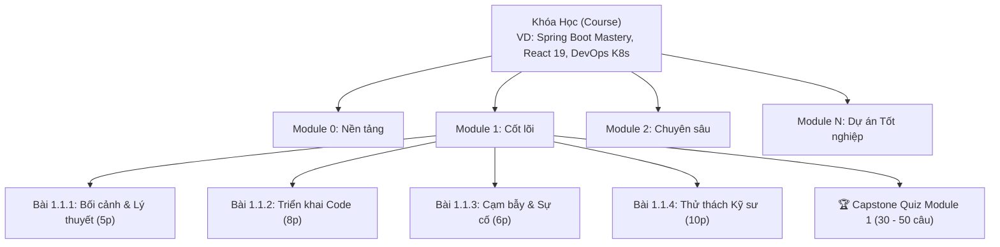
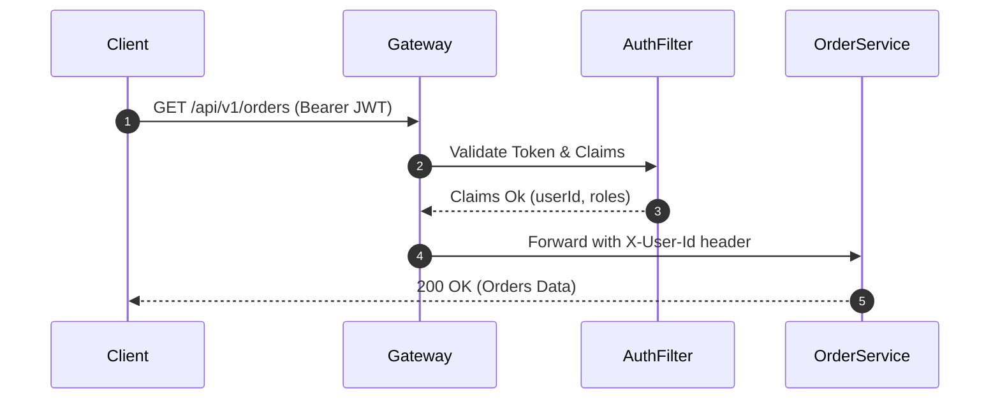

# BỘ QUY CHUẨN THIẾT KẾ KHÓA HỌC & BÀI HỌC
## DevMastery Course & Curriculum Engineering Standard (CES-2026)

> **Tài liệu tham chiếu chuẩn hóa dành cho Giảng viên, Kỹ sư Nội dung và Hệ thống AI Agent khi xây dựng khóa học mới trên nền tảng DevMastery Academy.**  
> *Áp dụng triết lý Micro-Learning chuẩn Udemy kết hợp Kiến trúc Kỹ sư Doanh nghiệp (Enterprise Engineering Handbook).*

---

## 1. Triết lý Thiết kế Giáo trình (Curriculum Philosophy)

### 1.1. Micro-Learning + Enterprise Real-World (Học vi mô thực chiến)
1. **Không dạy lý thuyết suông:** Mọi bài học đều phải xuất phát từ bài toán thực tế của doanh nghiệp (Ngân hàng, Fintech, E-commerce, hệ thống phân tán chịu tải cao).
2. **Quy tắc Single Responsibility Principle (SRP per Lesson):** Mỗi bài học chỉ giải quyết trọn vẹn **đúng 1 mục tiêu duy nhất** (ví dụ: tạo 1 Entity, giải thích 1 cơ chế Reflection, xử lý 1 loại Exception, cấu hình 1 Docker Layer).
3. **Thời lượng học tối ưu:** Mỗi bài đọc & thực hành được thiết kế từ **5 đến 12 phút** (tối đa 15 phút). Học viên có thể tranh thủ học bất cứ lúc nào mà không bị ngợp.
4. **Vòng lặp tạo động lực (Dopamine Loop):** Thanh tiến độ và dấu tick xanh cập nhật liên tục sau mỗi bài học nhỏ, giúp học viên luôn duy trì cảm giác hoàn thành và tiến bộ.

---

## 2. Cấu trúc Thứ bậc 3 Cấp (3-Tier Hierarchy)

Mọi khóa học trên hệ thống bắt buộc phải tổ chức theo mô hình phân cấp:



* **Cấp 1 — Khóa học (Course):** Một lộ trình học tập hoàn chỉnh từ cơ bản đến production (khoảng 35h đến 80h đào tạo, bao gồm 4 đến 8 module, tổng cộng 150 – 350+ bài học vi mô).
* **Cấp 2 — Học phần (Module):** Một cột mốc kỹ năng trọng điểm (Milestone). Mỗi module gồm 20 đến 70 bài học vi mô và kết thúc bằng 1 bài sát hạch Capstone Quiz.
* **Cấp 3 — Bài học vi mô (Micro-Lesson):** Bài học chi tiết 5 - 12 phút có code mẫu, hình ảnh/sơ đồ và cạm bẫy thực tế.
* **Cấp 3 (Cuối Module) — Bài thi sát hạch (Capstone Quiz):** Bài thi trắc nghiệm tình huống chuyên sâu (30 - 50 câu) kiểm tra toàn diện năng lực của học viên trước khi sang module kế tiếp.

---

## 3. Quy chuẩn Cấp Khóa Học (Course-Level Standard)

Mỗi khóa học phải khai báo đầy đủ các trường Metadata sau trong mảng `COURSES` (`course/js/app.js`) hoặc trong file dữ liệu riêng (`course/js/content/course_[ten_khoa].js`):

```javascript
{
  id: "ten-khoa-hoc-mastery",            // Định dạng kebab-case duy nhất
  title: "Tên Khóa Học — Tagline Doanh Nghiệp Hấp Dẫn",
  shortTitle: "Tên Ngắn Gọn",             // Tối đa 25 ký tự (hiển thị trên Navbar & Mobile)
  icon: "🍃",                             // Emoji nhận diện thương hiệu
  badge: "Backend & Microservices",       // Nhãn danh mục (Badge)
  category: "backend",                    // "backend" | "frontend" | "devops" | "cloud"
  level: "Zero to Production",            // "Foundation" | "Zero to Production" | "Advanced"
  hours: "~80h",                          // Tổng thời lượng ước tính
  modulesCount: 8,                        // Số lượng Module (4 - 8 module)
  lessonsCount: 354,                      // Tổng số bài học micro-learning
  quizCount: 256,                         // Tổng số câu hỏi trắc nghiệm toàn khóa
  rating: 4.9,                            // Điểm đánh giá (4.8 - 5.0)
  reviewsCount: "3,840",                  // Số lượt đánh giá
  studentsCount: "12,500",                // Số lượng học viên
  instructor: "DevMastery Academy & Senior Engineers",
  bestseller: true,                       // true: Bán chạy nhất | false: Mới & Nổi bật
  originalPrice: "1.990.000 ₫",           // Giá gốc trước khi giảm
  themeGradient: "linear-gradient(135deg, #064e3b 0%, #047857 50%, #10b981 100%)", // Màu bìa card 16:9
  desc: "Mô tả khóa học chi tiết từ 1 đến 2 câu đầy đủ công nghệ trọng tâm.",
  tags: ["Java 21", "Spring Boot 3", "Microservices", "Docker", "Kubernetes"],
  isAvailable: true,                      // true: Đã mở học | false: Sắp ra mắt (Coming soon)
  modules: []                             // Danh sách các Module (chi tiết bên dưới)
}
```

---

## 4. Quy chuẩn Cấp Module (Module-Level Standard)

Mỗi Module là một học phần độc lập, đại diện cho một chủ đề kiến trúc lớn.

### 4.1. Quy định về số lượng
* Một khóa học tiêu chuẩn phải có từ **4 đến 8 module**.
* Module đầu tiên (`Module 0`): Luôn dành cho **Nền tảng, Kiến trúc bên dưới & Chuẩn bị Môi trường Enterprise**.
* Module cuối cùng (`Module N`): Luôn là **Dự án Tốt nghiệp Thực chiến End-to-End (Capstone Production Project)**.
* Mỗi module phải chứa từ **20 đến 70 bài học vi mô**.

### 4.2. Khai báo dữ liệu Module

```javascript
{
  id: 1,                                  // Số nguyên liên tục (0, 1, 2, 3...)
  title: "Spring Core & Boot Căn Bản",     // Tên chủ đề chính
  subtitle: "IoC Container, Bean Lifecycle, AOP & Auto-configuration",
  icon: "🌱",                             // Emoji đại diện cho module
  desc: "Mô tả chi tiết nội dung và mục tiêu đầu ra của module này.",
  lessons: [ ... ]                        // Danh sách Micro-Lessons + 1 Capstone Quiz cuối cùng
}
```

---

## 5. Quy chuẩn Cấp Bài Học Vi Mô (Micro-Lesson Standard)

### 5.1. Định dạng Mã bài học (Lesson ID)
* Cú pháp bắt buộc: `[ModuleId]-[TopicIndex]-[SubIndex]`
* Ví dụ:
  * `0-1-1`: Module 0, Chủ đề 1, Bài vi mô 1.
  * `1-2-3`: Module 1, Chủ đề 2, Bài vi mô 3.
  * `2-4-2`: Module 2, Chủ đề 4, Bài vi mô 2.

### 5.2. Quy chuẩn Đặt Tên Tiêu Đề Bài Học (Lesson Title)
* Tiêu đề bắt buộc phải có tiền tố đánh số thứ tự:
  $$\text{Bài } [Module].[Chủ đề].[Mục]: \text{ [Tên Kỹ Thuật Rõ Ràng]}$$
* **Ví dụ chuẩn mực:**
  * `Bài 1.1.1: Vấn đề sống còn: Tight Coupling giết chết khả năng mở rộng`
  * `Bài 1.1.2: Cơ chế ngầm: Inversion of Control & ApplicationContext Pipeline`
  * `Bài 1.1.3: Ba kiểu Dependency Injection — Tại sao Constructor là vị vua tuyệt đối?`
  * `Bài 1.1.4: Triển khai Code Sản Xuất: Xử lý Đa Cổng Thanh Toán Chuẩn Doanh Nghiệp`
  * `Bài 1.1.5: Cạm bẫy Bean Scopes & Sự cố Prototype trong Singleton`
  * `Bài 1.1.6: Thử thách Kỹ sư: Xây dựng Dynamic Plugin Container với Spring DI`
* **Tuyệt đối tránh:**
  * ❌ `Bài 1: Lý thuyết` (Quá mơ hồ)
  * ❌ `Thực hành code` (Không biết thực hành cái gì)
  * ❌ Tiêu đề quá dài trên 90 ký tự làm vỡ giao diện Sidebar di động.

### 5.3. Phân loại Bài học (Lesson Types)
Mỗi bài học được gắn đúng một thuộc tính `type` để hệ thống tự render huy hiệu và màu sắc tương ứng:

| `type` | Tên hiển thị | Ý nghĩa & Nội dung bắt buộc |
|---|---|---|
| `theory` | 📖 Lý thuyết | Phân tích cơ chế ngầm (Under the Hood), kiến trúc nội tại JVM/Framework, sơ đồ Mermaid. |
| `practice` | 💻 Thực hành | Triển khai mã nguồn hoàn chỉnh, cấu hình YAML, kịch bản lệnh cURL kiểm thử. |
| `pitfall` | ⚠️ Cạm bẫy & Sự cố | Phân tích lỗi production kinh điển, memory leak, deadlock, bảo mật và bài học Post-Mortem. |
| `challenge` | 🏆 Thử thách Kỹ sư | Bài toán hóc búa yêu cầu học viên tự giải quyết, kèm gợi ý và Lời giải mẫu chuẩn (Reference Solution). |
| `quiz` | 🎯 Trắc nghiệm | Bài thi trắc nghiệm cuối module (30 - 50 câu). |

### 5.4. Định mức Thời lượng (Estimated Minutes)
* Mỗi bài học phải khai báo trường `minutes`:
  * Bài lý thuyết / cạm bẫy: **5 đến 8 phút**.
  * Bài thực hành code / thử thách: **8 đến 15 phút**.
  * Bài Quiz module: **15 đến 30 phút**.

---

## 6. Khung Cấu Trúc Nội Dung Bài Học Chuẩn (The 5-Part Lesson Blueprint)

Mỗi file nội dung Markdown của bài học bắt buộc phải tuân theo cấu trúc 5 phần chuẩn sau:

### Phần 1: Hook / Bối cảnh Thực tế Doanh nghiệp (Real-World Context)
Nêu rõ vấn đề nhức nhối trong thực tế nếu không áp dụng kỹ thuật này (ví dụ: website sập lúc Flash Sale, rò rỉ dữ liệu khách hàng, rớt hiệu năng 80%).

### Phần 2: Cơ Chế Hoạt Động & Sơ Đồ Trực Quan (Under the Hood & Diagram)
Giải thích bản chất kỹ thuật bên dưới. **Bắt buộc có ít nhất 1 sơ đồ Mermaid hoặc ASCII art minh họa luồng xử lý**:



### Phần 3: Mã Nguồn Chuẩn Doanh Nghiệp (Production-Grade Code)
* Code viết theo chuẩn Clean Code, SOLID, có đầy đủ annotations.
* Có comment giải thích chi tiết bằng tiếng Việt ở các dòng logic then chốt.
* Định dạng code block có chỉ định ngôn ngữ rõ ràng (`~~~java`, `~~~yaml`, `~~~sql`, `~~~json`, `~~~bash`).

### Phần 4: Cạm Bẫy Production & Sự Cố Hậu Kiểm (Pitfalls & Post-Mortem)
Chỉ ra ít nhất **1 đến 2 cạm bẫy chết người** mà lập trình viên hay mắc phải khi đưa tính năng này lên production, kèm theo cách khắc phục triệt để.

### Phần 5: Khối Nhắc Nhở & Ghi Nhớ Cốt Lõi (Callout Boxes & Key Takeaways)
Sử dụng các hộp ghi chú chuẩn:

```markdown
:::tip Mẹo Kỹ Sư Senior
Kinh nghiệm tối ưu hiệu năng, tham số tuning hoặc mẹo phỏng vấn liên quan.
:::

:::warn Cảnh Báo Nguy Hiểm
Lỗi bảo mật tiềm ẩn, cạm bẫy rò rỉ kết nối database (Connection Leak) hoặc lỗi OOM.
:::

:::takeaways Ghi Nhớ Cốt Lõi
- Gạch đầu dòng 1: Kiến thức quan trọng nhất cần nắm.
- Gạch đầu dòng 2: Quy tắc vàng khi code tính năng này.
:::
```

---

## 7. Quy chuẩn Bài Thi Sát Hạch Module (Capstone Quiz Standard)

Mỗi Module phải có **duy nhất 1 bài Quiz** nằm ở vị trí cuối cùng trong danh sách bài học:

```javascript
{
  id: "1-quiz",
  type: "quiz",
  title: "Quiz Module 1 — Spring Core & Auto-configuration",
  minutes: 25,
  questions: [ ... ]
}
```

### 7.1. Tiêu chí Câu hỏi Sát hạch
1. **Số lượng:** Tối thiểu **30 câu hỏi**, khuyến nghị **35 đến 50 câu hỏi** cho mỗi module.
2. **Loại câu hỏi:** 100% câu hỏi phải dựa trên **tình huống kỹ thuật thực tế (Scenario-based)** hoặc phân tích đoạn code thực tế (Code snippet analysis). Không dùng các câu hỏi định nghĩa từ điển sơ sài.
3. **Phương án trả lời:** Luôn gồm 4 phương án (A, B, C, D) với các đáp án nhiễu (Distractors) được thiết kế khéo léo để kiểm tra đúng chiều sâu tư duy.
4. **Giải thích chuyên sâu (Deep Explanation):** Trường `explain` bắt buộc phải giải thích chi tiết:
   - Tại sao đáp án được chọn là đúng?
   - Tại sao từng đáp án còn lại là sai hoặc gây lỗi gì ở production?

### 7.2. Cấu trúc JSON 1 câu hỏi mẫu

```javascript
{
  id: "q-1-1",
  q: "Một Service được đánh dấu @Transactional gọi một method private cùng class có @Transactional(propagation = Propagation.REQUIRES_NEW). Hiện tượng gì sẽ xảy ra ở runtime?",
  options: [
    "Một transaction mới độc lập sẽ được tạo ra cho method private.",
    "Spring ném ra exception IllegalTransactionStateException lúc biên dịch.",
    "Method private chạy chung trong transaction hiện tại, annotation REQUIRES_NEW bị bỏ qua hoàn toàn do cạm bẫy Self-Invocation của Spring AOP Dynamic Proxy.",
    "Cả hai transaction cùng bị rollback ngay lập tức."
  ],
  answer: 2,
  explain: "Spring AOP sử dụng CGLIB hoặc JDK Dynamic Proxy bao bọc bên ngoài Bean. Khi một method gọi nội bộ (internal call / this.method), lời gọi không đi qua Proxy nên toàn bộ logic Transaction Interceptor bị bỏ qua. Để khắc phục, cần tách method sang Service khác hoặc dùng AspectJ compile-time weaving."
}
```

---

## 8. Quy trình Thêm Khóa Học Mới vào Hệ Thống (Developer Step-by-Step Workflow)

Khi muốn thêm bất kỳ khóa học mới nào (ví dụ: `Vue.js 3`, `Golang Microservices`, `Python AI`), kỹ sư chỉ cần làm theo 5 bước tiêu chuẩn:

### Bước 1: Tạo file nội dung giáo trình
Tạo file mới tại đường dẫn: `course/js/content/course_[tech].js` (Ví dụ: `course/js/content/course_golang.js`).  
File này khai báo vào đối tượng `window.EXTRA_COURSES["golang-mastery"]`.

### Bước 2: Khai báo vào danh mục toàn hệ thống
Mở file `course/js/app.js`:
1. Thêm metadata của khóa học vào mảng `COURSES`.
2. Kiểm tra `lessonsCount` và `quizCount` khớp với nội dung.

### Bước 3: Nhúng script vào trang chủ
Mở file `course/index.html`:
Thêm thẻ `<script>` tải file nội dung trước thẻ `js/app.js`:
```html
<script src="js/content/course_golang.js"></script>
```

### Bước 4: Kiểm thử hiển thị & Layout bằng Script Tự động
Chạy script kiểm thử để đảm bảo:
* Thẻ khóa học hiển thị chuẩn xác số bài, badge, hình ảnh.
* Toàn bộ micro-lessons mở ra mượt mà, không bị vỡ giao diện hay tràn ngang màn hình điện thoại (Mobile Responsive 390px).

### Bước 5: Triển khai & Đồng bộ GitHub Pages
Commit mã nguồn lên nhánh `main`, sau đó đồng bộ thư mục `course/*` sang nhánh `gh-pages` để hệ thống cập nhật trực tiếp trên production:
```bash
git checkout main
git add course/
git commit -m "feat(course): add Golang Microservices Mastery course"
git push origin main

# Đồng bộ GitHub Pages
git checkout gh-pages
git checkout main -- course
# Copy đè file ra root gh-pages và commit push
```

---

## 9. Bộ Template Mẫu Hoàn Chỉnh (Copy-Paste Ready Boilerplate)

### 9.1. Template File Khóa Học Mới (`course_new_template.js`)

```javascript
/* =========================================================================
   [Tên Khóa Học] — Fullstack / Enterprise Curriculum
   ========================================================================= */
(function() {
  "use strict";

  window.EXTRA_COURSES = window.EXTRA_COURSES || {};

  window.EXTRA_COURSES["my-new-course"] = {
    id: "my-new-course",
    title: "Tên Khóa Học Mới — Từ Zero Đến Production",
    shortTitle: "Tên Ngắn",
    icon: "🚀",
    badge: "Backend & Cloud",
    category: "backend",
    level: "Zero to Production",
    hours: "~45h",
    modulesCount: 4,
    lessonsCount: 120,
    quizCount: 160,
    rating: 4.9,
    reviewsCount: "1,200",
    studentsCount: "5,400",
    instructor: "DevMastery Academy & Senior Architects",
    bestseller: false,
    originalPrice: "1.490.000 ₫",
    themeGradient: "linear-gradient(135deg, #1e1b4b 0%, #312e81 50%, #4338ca 100%)",
    desc: "Mô tả khóa học súc tích, chuyên sâu, nêu bật các công nghệ lõi.",
    tags: ["Tech1", "Tech2", "Docker", "Architecture"],
    isAvailable: true,
    modules: [
      {
        id: 0,
        title: "Nền tảng & Kiến trúc Tổng quan",
        subtitle: "Setup môi trường, CLI, công cụ và tư duy kiến trúc",
        icon: "⚡",
        desc: "Mô tả mục tiêu của Module 0.",
        lessons: [
          {
            id: "0-1-1",
            type: "theory",
            title: "Bài 0.1.1: Giới thiệu Kiến trúc & Mục tiêu Khóa học",
            minutes: 6,
            content: `## Giới thiệu & Mục tiêu Chuẩn Kỹ sư

Chào mừng bạn đến với lộ trình thực chiến...

## 1. Bản chất Kiến trúc (Under the Hood)
Phân tích nguyên lý hoạt động bên dưới...

:::takeaways Ghi nhớ cốt lõi
- Nắm vững kiến trúc tổng quan.
- Chuẩn bị đầy đủ công cụ trước khi bắt đầu bài lab.
:::
`
          },
          {
            id: "0-quiz",
            type: "quiz",
            title: "Quiz Module 0 — Sát hạch Nền tảng Kiến trúc",
            minutes: 20,
            questions: [
              {
                id: "q-0-1",
                q: "Câu hỏi trắc nghiệm tình huống số 1?",
                options: ["Đáp án A", "Đáp án B chuẩn", "Đáp án C", "Đáp án D"],
                answer: 1,
                explain: "Giải thích chi tiết tại sao đáp án B đúng và các case thực tế liên quan."
              }
            ]
          }
        ]
      }
    ]
  };
})();
```

---

## 10. Checklist Nghiệm Thu Khóa Học Mới (Definition of Done)

Trước khi phát hành một khóa học mới lên môi trường Live, phải kiểm tra đạt 100% các tiêu chí sau:

- [ ] **Khóa học có từ 4 đến 8 Module**, có đầy đủ Module 0 (Nền tảng) và Module cuối (Dự án tốt nghiệp).
- [ ] **Mỗi bài học là một micro-lesson 5 - 12 phút**, tuân thủ nguyên tắc Single Responsibility.
- [ ] **Tiêu đề bài học có đánh số chuẩn**: `Bài [Module].[Chủ đề].[Phần]: [Tên kỹ thuật]`.
- [ ] **100% bài học có code snippet** định dạng ngôn ngữ chuẩn, không chứa lỗi cú pháp.
- [ ] **Mỗi bài học đều có Callout Box** (`:::tip`, `:::warn`, hoặc `:::takeaways`).
- [ ] **Mỗi Module có 1 bài Capstone Quiz** tối thiểu 30 câu hỏi trắc nghiệm có lời giải thích sâu (`explain`).
- [ ] **Giao diện di động (Mobile Responsive 390px)** hiển thị mượt mà, không tràn viền, modal và sidebar đóng mở chuẩn xác.
- [ ] **Đã deploy đồng bộ** trên cả 2 nhánh `main` và `gh-pages`.
