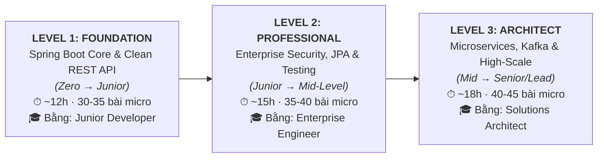
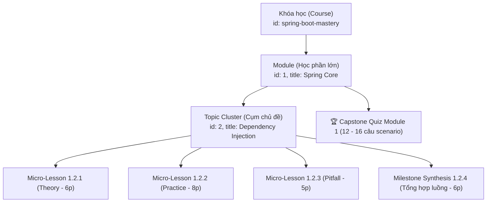

# BỘ QUY CHUẨN KỸ THUẬT THIẾT KẾ KHÓA HỌC (CES-2026 v2.2)
## DevMastery Course & Curriculum Engineering Standard — Consensus Edition

> **Tài liệu đặc tả kỹ thuật bắt buộc dành cho Giảng viên, Kỹ sư Nội dung và Hệ thống AI Agent khi biên soạn hoặc thẩm định bất kỳ khóa học nào trên DevMastery Academy.**  
> *Được chuẩn hóa dựa trên triết lý Micro-Learning thực dụng, tích hợp biên bản đồng thuận 3-Agent (Product - Systems Architecture - Cognitive Science) và cơ chế Phân tầng Cấp độ & Thi Vượt Cấp (Multi-Level & Skill Placement Engine).*

---

## 1. Triết Lý Thiết Kế: Thực Dụng & Khép Kín (Pragmatic Engineering)

1. **Text-First & Interactive (Kiểu Educative):** Kỹ sư đọc và đối chiếu code nhanh gấp 2–3 lần xem video 40 giờ. Không dùng video thụ động; 100% nội dung là tài liệu kỹ thuật có thể tra cứu nhanh (`Ctrl + K`), copyable snippets và sơ đồ rõ ràng.
2. **Nhịp độ hoàn thành Micro-Pacing (Kiểu Udemy):** Phân rã bài học theo **Single Responsibility Principle (SRP)**. Mỗi bài giải quyết trọn vẹn đúng 1 vấn đề trong **5 – 10 phút**.
3. **Cạm bẫy & Sự cố Hậu kiểm (Kiểu ByteByteGo):** Không dạy ví dụ đồ chơi (Toy Code: `foo/bar`, `Cat/Dog`). 100% bài học xuất phát từ ngữ cảnh sản xuất: Ngân hàng, Cổng thanh toán, Sàn thương mại điện tử, Hệ thống phân tán chịu tải cao.
4. **Cơ chế Hai Làn Học Tập (Dual-Track Progression):**
   * **Làn Khảo sát (Audit Track):** Học viên tự do truy cập bất kỳ bài nào, không bị khóa cổng 80%, phù hợp kỹ sư cần tra cứu nhanh giải pháp gỡ lỗi tức thì tại doanh nghiệp.
   * **Làn Chứng chỉ (Certified Track):** Bắt buộc vượt qua cổng 80% Quiz từng Module và nộp Đồ án Capstone pass kiểm thử tự động mới được cấp Chứng chỉ số ký xác thực (Verified Certificate).

---

## 2. Định Mức Quy Mô Chuẩn (Scale Caps & Boundary Limits)

Để triệt tiêu tình trạng "sinh nội dung cho đủ số" làm loãng chất lượng, spec quy định rõ trần định mức cứng (Hard Ceiling Caps):

| Thông số | Bản MVP (Minimum Viable Course) | Khóa Standard hoàn chỉnh | Trần tối đa (Hard Ceiling) |
|---|:---:|:---:|:---:|
| **Số lượng Module** | **4 Module** | **5 – 6 Module** | **8 Module** |
| **Số bài học / Module** | **12 – 16 bài** | **15 – 20 bài** | **22 bài** |
| **Tổng số bài học toàn khóa** | **60 – 80 bài** | **90 – 120 bài** | **Tối đa 150 bài** |
| **Số câu Quiz / Module** | **10 – 12 câu** | **12 – 16 câu** | **Tối đa 18 câu** |
| **Thời lượng đọc & lab / bài** | **5 – 8 phút** | **6 – 10 phút** | **Tối đa 15 phút** |
| **Đồ án Capstone** | 1 đồ án Mini-Service | 1 đồ án End-to-End | 1 hệ thống hoàn chỉnh |

> [!IMPORTANT]
> **Quy tắc trần cứng (Ceiling Rule):** Tuyệt đối không sinh khóa học vượt quá 150 bài vi mô hoặc module quá 22 bài. Nếu một chủ đề quá rộng, bắt buộc phải tách thành các khóa học độc lập theo từng cấp độ (Level).

### 2.1. Quy Chuẩn Phân Tầng Cấp Độ (Multi-Level Course Segmentation — 3-Stage Career Track)

Tuyệt đối **cấm mô hình "Khóa học Monolith 80 giờ đi từ Zero đến Chuyên gia"**. Thực tế đào tạo toàn cầu chứng minh mô hình này có tỷ lệ bỏ học (drop-out) > 90% vì gây ra hiện tượng *"Kẻ đói thì nghẹn, người no thì ngán"* (Junior ngợp kiến thức gãy giữa chừng, Senior chán nản vì phải xem lại bài cài đặt căn bản).

Mọi ngăn xếp công nghệ lớn (như Java/Spring Boot, React/Next.js, Cloud DevOps) bắt buộc phải được quy hoạch thành **Lộ trình 3 Chặng (3-Stage Milestone Track)** với các khóa học độc lập có chứng chỉ riêng từng chặng:



#### Phân tách thực tế đối với khóa Spring Boot:
* **Khóa 1 (Level 1 — Foundation): `spring-boot-foundation`**
  - Gồm Module 0 (Java 21/Maven) + Module 1 (Spring Core/IoC/DI) + Module 2 (REST API, RFC 7807).
  - Mục tiêu: Từ Zero viết được REST API chuẩn mực doanh nghiệp, hiểu rõ Bean lifecycle.
* **Khóa 2 (Level 2 — Professional): `spring-boot-professional`**
  - Gồm Module 3 (JPA/Hibernate N+1, Locking) + Module 4 (JUnit 5, Testcontainers) + Module 5 (Spring Security 6, JWT, Keycloak).
  - Mục tiêu: Tối ưu hóa Database, bảo mật ngân hàng, test tự động đạt chuẩn CI/CD.
* **Khóa 3 (Level 3 — Architect): `spring-boot-architect`**
  - Gồm Module 6 (Kafka, Transactional Outbox, Saga, Redis) + Module 7 (Kubernetes, Observability, Capstone Project).
  - Mục tiêu: Thiết kế hệ thống phân tán chịu tải cao, giao dịch phân tán không mất dữ liệu, tự động hóa deploy cloud.

---

## 3. Cấu Trúc Thứ Bậc Dữ Liệu Đồng Nhất (Unified Hierarchy)

Để mã bài học (`Bài 1.2.3`), URL deep-link và Sidebar luôn khớp nhau 100%, cấu trúc phân cấp dữ liệu trong code bắt buộc tuân thủ **4 cấp độ đồng nhất**:



### Quy tắc sinh Lesson ID & Title:
* **Mã ID:** `[moduleId]-[topicIndex]-[subIndex]` (Ví dụ: `1-2-1`, `1-2-2`, `1-2-3`).
* **Tiêu đề bài học:**
  $$\text{Bài } [Module].[Topic].[Sub]: \text{ [Tên Kỹ Thuật Đơn Nhất]}$$
  *Ví dụ:* `Bài 1.2.1: Cơ chế ngầm: Inversion of Control & ApplicationContext Pipeline`
* **Deep-link Router:** `/courses/{courseId}/lessons/{moduleId}-{topicIndex}-{subIndex}`

---

## 4. Đặc Tả Dữ Liệu (Data Schema Standards)

### 4.1. Course Schema (`course_[tech].js` / `app.js`)
Loại bỏ hoàn toàn các số liệu marketing hardcode (`rating`, `studentsCount`). Phải có `outcomes`, `prerequisites`, `notFor`, `stackVersion`.

```javascript
{
  id: "spring-boot-mastery",
  title: "Spring Boot Mastery — Từ Zero Đến Production",
  shortTitle: "Spring Boot Mastery",
  icon: "🍃",
  badge: "Backend & Microservices",
  category: "backend",                    // "backend" | "frontend" | "devops" | "cloud"
  level: "Zero to Production",            // "Foundation" | "Zero to Production" | "Advanced"
  hours: "~35h",                          // Tổng giờ đọc và hoàn thành lab thực tế
  
  // Định hướng đối tượng & Cam kết đầu ra
  desc: "Lộ trình đào tạo toàn diện Spring Boot 3 & Java 21, kiến trúc Microservices và bảo mật doanh nghiệp.",
  outcomes: [
    "Tự thiết kế và triển khai RESTful API chuẩn RFC 7807 với Spring Boot 3",
    "Làm chủ vòng đời Bean, AOP Proxy và khắc phục dứt điểm cạm bẫy Self-Invocation",
    "Tối ưu truy vấn JPA/Hibernate, triệt tiêu lỗi N+1 bằng EntityGraph và Projections",
    "Bảo vệ hệ thống với Spring Security 6, JWT và phân quyền OAuth2/Keycloak",
    "Đóng gói Docker Layered Jar và triển khai Kubernetes với Zero-Downtime"
  ],
  prerequisites: [
    "Đã nắm vững cú pháp Java Core cơ bản (OOP, Interface, Collections)",
    "Biết sử dụng Git cơ bản và hiểu nguyên lý hoạt động của HTTP/REST"
  ],
  notFor: [
    "Người chưa từng học bất kỳ ngôn ngữ lập trình nào (cần học Java Core trước)",
    "Người chỉ tìm kiếm video lý thuyết để ngồi xem thụ động"
  ],

  // Quản trị vòng đời công nghệ (Tech Lifecycle)
  stackVersion: {
    java: "21 LTS",
    springBoot: "3.3+",
    hibernate: "6.5+",
    lastReviewedDate: "2026-10-04",
    maintainer: "DevMastery Architecture Council"
  },

  // Chỉ số thống kê (TÁCH BIỆT: Chỉ render khi có dữ liệu thật từ database)
  stats: null, // Hoặc: { rating: 4.9, reviewsCount: 380, enrolledCount: 1250 }

  themeGradient: "linear-gradient(135deg, #064e3b 0%, #047857 50%, #10b981 100%)",
  isAvailable: true,
  modules: [ ... ]
}
```

### 4.2. Module Schema
Bắt buộc có `outcomes`, `retrievalWarmup` (3 câu hỏi kích hoạt trí nhớ từ module trước) và mảng `topics`:

```javascript
{
  id: 1,
  title: "Spring Core & Container Internals",
  subtitle: "IoC Container, Dynamic Proxy, Bean Lifecycle & Auto-configuration",
  icon: "🌱",
  color: "#22c55e",
  desc: "Đào sâu bản chất hoạt động của Spring Framework bên dưới lớp vỏ cú pháp.",
  
  outcomes: [
    "Hiểu cặn kẽ cơ chế Reflection và ApplicationContext khởi tạo Bean",
    "Phân biệt CGLIB vs JDK Dynamic Proxy và tránh lỗi Self-Invocation @Transactional",
    "Tự viết được Spring Boot Starter tái sử dụng trong nội bộ doanh nghiệp"
  ],

  // Kích hoạt trí nhớ (Spaced Retrieval): 3 câu trắc nghiệm nhanh kiểm tra module trước
  retrievalWarmup: (moduleId === 0) ? null : [
    {
      q: "Điểm khác biệt cốt lõi giữa Java Record và Class thông thường là gì?",
      options: ["Record có thể kế thừa class khác", "Record mặc định bất biến (immutable) và final", "Record không có equals/hashCode", "Record chỉ chạy trên JVM 8"],
      answer: 1
    }
  ],

  topics: [
    {
      id: 1,
      title: "Inversion of Control & Dependency Injection",
      lessons: [ ... ] // 3 - 5 micro-lessons
    },
    {
      id: 2,
      title: "AOP & Dynamic Proxies",
      lessons: [ ... ] // 3 - 5 micro-lessons
    }
  ],

  // Bài thi sát hạch cuối module (12 - 16 câu)
  quiz: {
    id: "1-quiz",
    title: "Sát Hạch Năng Lực Module 1: Spring Core & Container",
    passThresholdPct: 80, // Tối thiểu 80% (áp dụng cho Certified Track)
    allowRetake: true,
    questions: [ ... ]
  }
}
```

---

## 5. Ma Trận Khung Nội Dung Theo Lesson Type (Flexible Blueprint Matrix)

Tuyệt đối **không ép một khuôn 5 phần cứng nhắc** cho mọi bài học. Mỗi `type` có quy định khối bắt buộc và khối cấm riêng:

| Thành phần nội dung | `theory` (📖 Lý thuyết) | `practice` (💻 Thực hành) | `pitfall` (⚠️ Cạm bẫy) | `challenge` (🏆 Thử thách) | `synthesis` (🗺️ Tổng hợp) |
|---|:---:|:---:|:---:|:---:|:---:|
| **Bối cảnh thực tế (Real-world Hook)** | **BẮT BUỘC** | Khuyến khích | **BẮT BUỘC** | **BẮT BUỘC** | Tùy chọn |
| **Sơ đồ Mermaid / Mental Model** | **BẮT BUỘC** | Tùy chọn | Tùy chọn | Không cần | **BẮT BUỘC (Sơ đồ lớn)** |
| **Mã nguồn chạy được (Runnable Code)** | Không ép (chỉ đoạn ngắn) | **BẮT BUỘC (100% test pass)** | Chỉ code lỗi & code sửa | Không (Chỉ trong Lời giải) | Không |
| **Lệnh kiểm thử (cURL / Test Command)** | Không | **BẮT BUỘC** | **BẮT BUỘC** | Không | Không |
| **Triệu chứng lỗi & Post-Mortem** | Không cần | Không cần | **BẮT BUỘC** | Không cần | Không cần |
| **Gợi ý giấu kín (Collapsible Hint)** | Không | Không | Không | **BẮT BUỘC** | Không |
| **Reference Solution & Trade-offs** | Không | Không | Không | **BẮT BUỘC** | Không |
| **Khối hộp ghi nhớ (`:::tip`, `:::warn`)** | `:::takeaways` | `:::tip` | `:::warn` / `:::danger` | `:::takeaways` | `:::takeaways` |

### 5.1. Cấu trúc bài `theory` (Thời lượng: 5 – 7 phút)
1. **The Why (Hook):** Vấn đề kiến trúc trong thực tế.
2. **Mental Model & Mermaid Diagram:** 1 sơ đồ giải thích trực quan luồng hoạt động.
3. **Under the Hood Explanation:** Cơ chế bên dưới JVM/Network/Kernel (300 – 600 từ).
4. **`:::takeaways`:** 2–3 gạch đầu dòng cốt lõi.

### 5.2. Cấu trúc bài `practice` (Thời lượng: 8 – 12 phút)
1. **Bài toán kinh doanh cụ thể:** (Ví dụ: API đối soát thanh toán MoMo).
2. **Triển khai Mã nguồn chuẩn:** Code hoàn chỉnh từ Model -> Repository -> Service -> Controller.
3. **Lệnh thực thi & Kiểm chứng (Verification):** Kịch bản lệnh cURL hoặc Test Class cụ thể, in rõ Output mẫu mong đợi.
4. **`:::tip`:** Mẹo Clean Code hoặc quy ước cấu trúc dự án.

### 5.3. Cấu trúc bài `pitfall` (Thời lượng: 5 – 8 phút)
1. **Triệu chứng (The Symptom):** Lỗi log gì văng ra ở production? Alert Prometheus cảnh báo cái gì?
2. **Căn nguyên kỹ thuật (Root Cause):** Tại sao code chạy ngon trên máy dev nhưng sập trên môi trường tải cao?
3. **Mã nguồn lỗi vs Mã nguồn khắc phục (Diff Code):** So sánh trực tiếp code SAI và code ĐÚNG.
4. **Bài học hậu kiểm (Post-Mortem):** Quy tắc viết Unit Test hoặc cấu hình Alert để lỗi không bao giờ tái diễn.

### 5.4. Cấu trúc bài `challenge` (Thời lượng: 10 – 15 phút) & Quy chuẩn Giàn giáo (Scaffolding)
* **Quy tắc Scaffolding:** Không bắt học viên viết từ đầu (Zero-scratch). Cung cấp sẵn một repo starter kit với 90% phần khung đã chạy, học viên chỉ cần điền đúng **1 hàm thuật toán lõi** hoặc **sửa đúng 1 file cấu hình lỗi** (Bug Bounty format).
* **Đặc tả yêu cầu & Ràng buộc:** Rõ ràng I/O, thời gian thực thi tối đa, memory footprint.
* **Gợi ý từng bước:** Giấu sau thẻ `<details>` để học viên tự tư duy trước.
* **Lời giải mẫu chuẩn:** Reference Solution đạt tiêu chuẩn Senior kèm phân tích đánh đổi (Trade-offs).

### 5.5. Cấu trúc bài `synthesis` (Thời lượng: 5 – 8 phút) — Chống Phân Mảnh Kiến Thức
* **Vị trí:** Nằm ở cuối mỗi Topic Cluster (sau 3–5 bài micro-learning).
* **Bản đồ luồng toàn cảnh (Grand Schema Map):** 1 sơ đồ Mermaid lớn kết nối toàn bộ các thành phần đã học thành 1 chu trình nghiệp vụ khép kín.
* **Bảng tổng kết quyết định (Decision Matrix):** Khi nào dùng kỹ thuật A vs khi nào dùng kỹ thuật B.

---

## 6. Quy Chuẩn Phần Cứng & Thoái Lui Mềm (Hardware Tolerance)

Để đảm bảo học viên dùng máy tính 8GB – 16GB RAM vẫn thực hành được trọn vẹn mà không bị tràn RAM Docker:

1. **Profile `local-lite` (Bắt buộc cho mọi bài thực hành):**
   * Sử dụng cơ sở dữ liệu In-Memory (H2 Database, Embedded Redis, MockWebServer).
   * Mức tiêu thụ RAM tối đa cho phép: `< 1.5 GB RAM`. Máy 8GB RAM chạy mượt mà.
2. **Profile `enterprise-docker` (Tùy chọn nâng cao):**
   * Dùng Docker Compose / Testcontainers thật (PostgreSQL, Kafka, Redis, Keycloak).
   * Dành cho học viên máy mạnh (16GB+ RAM) muốn thử nghiệm sát hạch môi trường tải cao.

---

## 7. Quy Chuẩn Đề Thi Sát Hạch (Capstone Quiz Standard)

### 7.1. Định mức & Tiêu chí
* **Số lượng:** **12 đến 16 câu hỏi** cho mỗi Module (không làm 30–50 câu loãng chất lượng).
* **100% câu hỏi tình huống (Scenario-Based):** Phân tích sự cố hạ tầng, lỗi race condition, deadlock, memory leak. Cấm câu hỏi định nghĩa từ điển.
* **4 Đáp án phân hóa (Plausible Distractors):** Đáp án sai phải phản ánh đúng những sai lầm thường gặp của lập trình viên Junior/Mid.
* **Bắt buộc phân tích đáp án (Deep Explanation):** Chỉ rõ tại sao đáp án đúng là giải pháp chuẩn, và tại sao từng đáp án sai sẽ gây ra lỗi gì ở production.

### 7.2. Cổng Năng Lực & Retake Policy
* **Ngưỡng đạt (Pass Threshold):** Trả lời đúng **tối thiểu 80%** (ví dụ: đúng 13/16 câu) trên *Certified Track*.
* **Cơ chế thi lại:** Nếu chưa đạt 80%, đề thi sẽ tự động tráo thứ tự câu hỏi và phương án. Hệ thống chỉ rõ học viên cần đọc lại bài vi mô cụ thể nào trước khi thi lại.

### 7.3. Quy Chuẩn Bài Test Đánh Giá Đầu Vào & Vượt Cấp (Skill Placement & Test-Out Engine)

Để loại bỏ hoàn toàn tình trạng kỹ sư Mid/Senior phải học lại bài cơ bản (syntax, Bean IoC) và bảo vệ Junior không bị ngợp, hệ thống áp dụng cơ chế **Bài Test Đánh Giá Năng Lực Đầu Vào (Skill Placement Test)** và **Cơ chế Thi Vượt Cấp (Test-Out Engine)**:

#### 1. Cấu trúc Đề Test Đầu Vào Chuẩn (15 Scenario Questions — 20 Phút)
Đề thi đánh giá năng lực gồm đúng **15 câu hỏi tình huống thực tế**, phân bổ đều qua 3 tầng năng lực:
* **Tầng 1 (5 câu Foundation - Level 1):**
  * Tình huống về IoC Container, Bean Scope (`singleton` vs `prototype`), Bean Lifecycle.
  * Thiết kế RESTful API, HTTP Status Code chuẩn, xử lý ngoại lệ RFC 7807 ProblemDetails.
* **Tầng 2 (5 câu Professional - Level 2):**
  * Tình huống Hibernate N+1 Query, LazyInitializationException, Indexing, Transaction Isolation & Locking.
  * Tình huống cấu hình Spring Security 6 SecurityFilterChain, JWT Claims, CORS/CSRF, Testcontainers integration testing.
* **Tầng 3 (5 câu Architect - Level 3):**
  * Tình huống Distributed Transaction, Transactional Outbox Pattern, Apache Kafka Idempotent Consumer, Saga Pattern.
  * Tình huống Redis Cache Stampede, Circuit Breaker (Resilience4j), Kubernetes Graceful Shutdown & Zero-Downtime Deployment.

#### 2. Ma Trận Phân Luồng Tự Động (Diagnostic Routing Matrix)
Dựa trên kết quả bài test 15 câu, hệ thống tự động gợi ý và điều hướng học viên:

| Điểm số đạt được | Tỷ lệ chính xác | Đánh giá năng lực | Luồng điều hướng đề xuất (Recommended Path) |
|---|:---:|---|---|
| **0 – 7 / 15** | `< 50%` | **Chưa vững nền tảng (Foundation Gap)** | Bắt đầu từ **Level 1 (Foundation)**. Khuyến cáo không nhảy cóc để tránh gãy kiến thức cốt lõi. |
| **8 – 11 / 15** | `50% – 79%` | **Đã có kinh nghiệm cơ bản (Mid-ready)** | Miễn học Level 1. Vào thẳng **Level 2 (Professional)** để học sâu JPA internals, Security 6 và Testing thực chiến. |
| **12 – 15 / 15** | `≥ 80%` | **Kỹ sư dày dạn (Senior / Lead)** | Miễn học Level 1 & Level 2. Vào thẳng **Level 3 (Architect)** để tập trung vào Microservices, Kafka và Hệ thống phân tán. |

#### 3. Quy Tắc Thi Vượt Cấp (Test-Out Engine Policy)
* **Quyền chủ động của học viên:** Học viên có quyền chọn làm bài Test-Out bất kỳ lúc nào để mở khóa ngay Level hoặc Module tiếp theo mà không cần hoàn thành tuần tự từng bài vi mô.
* **Cơ chế Fast Track vs Deep Track:** Nếu học viên chọn Test-Out vào Level cao hơn nhưng sau đó gặp khó khăn, hệ thống cho phép lùi lại xem các bài vi mô ở Level thấp hơn mà không bị mất tiến độ đã làm.
* **Chống gian lận & Bảo vệ tính xác thực (Integrity Guard):**
  * Thời gian làm bài giới hạn đúng **20 phút / 15 câu** (trung bình 80 giây/câu tình huống, triệt tiêu thời gian tra cứu Google/ChatGPT).
  * Ngân hàng đề xoay vòng tối thiểu 60 câu tình huống, thuật toán tráo ngẫu nhiên thứ tự câu hỏi và phương án.
  * Cấm copy/paste câu hỏi ra ngoài giao diện làm bài.

---

## 8. Quy Chuẩn Đồ Án Tốt Nghiệp Cuối Khóa (Capstone Project & Automated Grading)

Module cuối cùng của khóa học **bắt buộc là Dự Án Thực Chiến (Capstone Project)**, không dùng trắc nghiệm làm thước đo.

### 8.1. Hệ Thống Chấm Điểm Tự Động (Automated Grading Harness)
Để đảm bảo tính khách quan và giảm 90% chi phí vận hành:
1. Học viên nộp đường link GitHub repository cá nhân.
2. **GitHub Actions Test Runner của DevMastery** tự động clone và kích hoạt:
   * `mvn test`: Chạy bộ test ẩn (Hidden Test Suite) xác thực 100% logic nghiệp vụ.
   * `ArchUnit Scanner`: Kiểm tra tính toàn vẹn kiến trúc phân tầng (không import chéo, không vi phạm Clean Architecture).
   * `k6 Runner`: Chạy kịch bản tải 500 TPS đo P95 Latency và kiểm tra Memory Leak.
3. Hệ thống sinh Scorecard tự động sau 3 phút.

### 8.2. Socratic AI Code Reviewer (Review Tài Liệu ADR)
* AI đóng vai trò Kỹ sư Trưởng (Principal Reviewer), phân tích file `ADR.md` (Architecture Decision Record) của học viên.
* AI đặt ra **2 câu hỏi phản biện chuyên sâu** về đánh đổi kỹ thuật (Trade-offs). Học viên bảo vệ được giải pháp của mình mới đạt chuẩn tốt nghiệp.

### 8.3. Bảng Rubric Đánh Giá (Grading Rubric Matrix)

| Tiêu chí | Cần cải thiện (0 điểm) | Đạt yêu cầu (1 điểm) | Xuất sắc (2 điểm) |
|---|---|---|---|
| **Clean Architecture** | Controller gọi trực tiếp Repository, logic nghiệp vụ lẫn lộn. | Phân tầng rõ ràng (API, Service, Domain, Persistence). Áp dụng DTO & MapStruct. | Tuân thủ Hexagonal / Modular Monolith, Domain Model thuần khiết, zero cycle dependencies. |
| **Error Handling & Validation** | Bỏ qua try/catch hoặc trả về HTTP 500 chung chung. | Có GlobalExceptionHandler, trả về JSON chuẩn RFC 7807 ProblemDetails. | Custom Business Exceptions rõ ràng, có trace ID phân tán và logging chi tiết. |
| **Database & Concurrency** | Lỗi N+1 tràn lan, không đánh Index, không xử lý tranh chấp dữ liệu. | Dùng JOIN FETCH/EntityGraph, đánh Index đúng cột, dùng Transaction chuẩn. | Xử lý Pessimistic/Optimistic Locking chống bán âm hàng Flash Sale, audit log tự động. |
| **Testing & CI/CD** | Không viết test hoặc test mock hết không có giá trị. | Unit test phủ các luồng chính, có chạy Testcontainers kiểm thử DB thực tế. | Phủ 80%+ test, có Contract Test (Pact) hoặc Chaos Engineering mô phỏng đứt mạng. |
| **Production Readiness** | Không có Docker, không có Actuator health check. | Có Dockerfile multi-stage, cấu hình Spring Boot Actuator `/health` và metrics. | Docker Layered Jar tối ưu cache, cấu hình Prometheus/Grafana dashboard, graceful shutdown. |

---

## 9. Quản Trị Vòng Đời Tự Động (Weekly Automated CI Pipeline)

Thay vì trông chờ vào việc con người rà soát thủ công:

1. **Weekly CI Matrix:** Toàn bộ code mẫu của khóa học được quản lý trong repo chuẩn và được GitHub Actions tự động build test vào **0h00 Chủ nhật hàng tuần**.
2. **Cơ chế Cảnh báo (Automated Breaking Change Alert):**
   * Nếu có bản vá thư viện hoặc JDK mới làm gãy code, GitHub Actions tự động bắn cảnh báo về kênh Discord/Telegram của ban quản trị.
   * Kỹ sư nội dung có SLA **72 giờ** để cập nhật bài học và code mẫu.

---

## 10. Định Nghĩa Hoàn Thành (Definition of Done — DoD)

Một bài học hoặc khóa học chỉ được coi là hoàn tất khi tích đủ các điều kiện sau:

- [ ] **Định mức khép kín:** Khóa MVP từ 60–80 bài, mỗi module từ 12–20 bài, không vượt trần 22 bài/module.
- [ ] **Data Model 4 cấp:** ID bài học theo đúng `module-topic-sub` (`1.2.3`), có mảng `topics: []`.
- [ ] **Chạy được thực tế (Run-tested):** 100% mã nguồn trong bài `practice` phải chạy thành công theo đúng lệnh hướng dẫn, có profile `local-lite` chạy dưới 1.5GB RAM.
- [ ] **Có bài Milestone Synthesis:** Mỗi Topic Cluster có 1 bài tổng hợp luồng kiến trúc bằng sơ đồ lớn.
- [ ] **Chuẩn Quiz kịch bản:** Quiz module từ 12–16 câu hỏi tình huống, 4 đáp án phân hóa, có `explain` sâu nguyên nhân lỗi production.
- [ ] **Phân tầng cấp độ & Test đầu vào:** Lộ trình được chuẩn hóa theo 3-Stage Milestone Track (Foundation, Professional, Architect) kèm bài Placement Test 15 câu phân luồng.
- [ ] **Hỗ trợ Dual-Track:** Hệ thống hỗ trợ cả chế độ Audit tự do và Certified có khóa cổng 80%.
- [ ] **Đồ án Capstone có Automated Test Harness:** Module cuối có repo mẫu, kịch bản CI chấm điểm tự động và AI phản biện ADR.
- [ ] **Loại bỏ số liệu ảo:** Metadata khóa học không chứa rating/học viên giả định nếu chưa kết nối nguồn dữ liệu thật.
- [ ] **Mobile Responsive:** Kiểm thử CDP hiển thị hoàn hảo trên viewport di động (390×844), không lỗi tràn ngang.
- [ ] **Đồng bộ Production:** Commit đầy đủ lên nhánh `main` và deploy thành công sang nhánh `gh-pages`.
